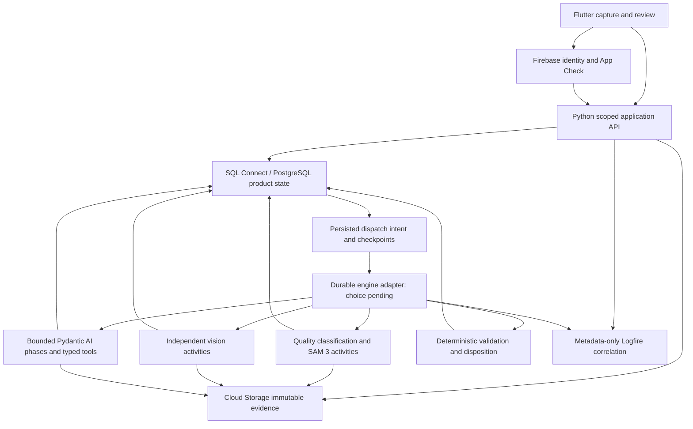

# Insects product architecture and baseline audit

Architecture task: `01a07f47-c8a6-7983-9d45-adfccf0971a9`.
Worktree: `/Users/anuragduddu/.codex/worktrees/969e/specimen-digitization-app`.
Branch: `codex/architecture-contracts`. Audited baseline: `82fd60e`.
Scope: architecture and contracts only; no product code or infrastructure mutation.
Contract: [CONTRACTS.md](CONTRACTS.md). Verification: [ACCEPTANCE.md](ACCEPTANCE.md).

## Outcome and authority

Build the Insects application as an authenticated Flutter client, a Python
application API, SQL Connect/Cloud SQL product persistence, immutable Cloud
Storage evidence, and independently scalable processing workers. Preserve the
existing Pydantic AI, Hugging Face gateway and Logfire foundations. A selected
durable workflow engine will coordinate application-owned checkpoints; no engine
is selected by this document. This architecture specifies a complete product,
while the audited baseline is a foundation, not a functioning vertical slice.

Read in full: repository AGENTS.md and deployment runbook; PRD v0.6 including all
functional requirements, 20 acceptance criteria, open decisions and approvals;
HARNESS_OPTIONS.md; HUGGINGFACE_MODEL_ROUTING.md; OBSERVABILITY_AND_EVALUATION.md;
GBIF.md; EMU_PARTIES_IRN_RESEARCH.md. The shared coordinator PLAN.md governs
ownership and was reread before final architectural decisions. No internal
research directory is present in this isolated worktree; it is intentionally
Git-ignored. Do not infer interview findings or institutional approval from that
absence. The coordinator can supply approved findings without copying private
transcripts into these public implementation documents.

## Code and history audit

All application Python modules and tests, Flutter application and widget test,
platform/dependency configuration inventory, repository safety configuration,
CI pipeline and canonical verification script were inspected. Native platform
folders contain generated Flutter runners/build configuration rather than a
second implementation of product behavior. The history contains ten commits
through the baseline, including two merge commits.

| Baseline area | Actual capability | Gap to the PRD |
|---|---|---|
| `transcription.py` | Frozen Pydantic literal output; lines reconstruct exact text; one route call and token/prompt metadata | No independent fan-out, durable raw provider envelope, regions, span graph, adjudication or persisted observations |
| `model_gateway.py` | Explicit Qwen/Novita and Muse/DeepInfra routes; automatic providers rejected; secret wrapped server-side | No tenant routing authorization, provider budgets, fallback evidence, revocation or production quality approval |
| `hub_models.py`, preflight | Revision-pinned SAM 3/Nemotron; route catalog and gated config access checks | No SAM 3 inference worker or segmentation-quality proof; downloading config is not segmentation |
| `prompts.py` | Three typed managed prompt templates and served-version evidence with code fallback | No immutable profile registry/promotion or persisted resolved prompt digest |
| `observability.py`, `tracing.py`, smoke | Metadata-default Logfire, binary exclusion, correlated stage spans and trusted context helpers | No complete lifecycle metrics, redaction proof across API/raw errors, alerting, retention or real workflow |
| `evaluation.py` | Exact literal, character, line and uncertainty scorers; two synthetic contract cases | No representative gold set, false-clear, field evidence, segmentation or workload benchmark |
| Flutter `main.dart` | Firebase initialization and one static status screen; Auth/Storage/Data Connect dependencies installed | Authentication journey, upload/camera, manifest, queues, review, accessible interactions and API integration all absent |
| SQL and object persistence | No baseline `dataconnect/` schema/operations or Storage rules in Git | Product transactional persistence, auth tests, restore and immutable evidence paths absent |
| CI/CD | Three PR gates and guarded Hosting-only production job with public SHA marker | No runtime/data release path, native device acceptance or product end-to-end acceptance |
| Tests | Foundation unit/contract tests and one static Flutter widget test | Passing baseline tests cannot demonstrate any full PRD section 19 criterion |

History anchors: `6ac896a` locked Insects clearance/Parties rules; `5a12b4b` and
`2210d5d` established API-first GBIF and recorded validation; `ac7d814` established
platform/release foundations; `27a10d2` deliberately changed the engine comparison
wording to a bounded comparison, not an all-local requirement; `29d53b0` added
observable prompt/evaluation foundations, merged as `82fd60e`. Do not reopen
Firestore, AWS, unbounded agents or early EMu export as unexplained alternatives.

Baseline defects to account for when extending: `SpecimenTraceContext` uses the
historical `temporal.workflow.id` attribute even though no engine is selected;
retain compatibility while introducing a neutral application workflow ID.
The baseline `ProcessingStage` telemetry enum is coarser than the full run stage
contract; map new stages explicitly rather than treating telemetry enum values
as a product state machine. Managed labels resolve mutable versions; persist the
served prompt content digest and code fallback revision before a resumable run.

## Component boundaries and data flow

The API authorizes commands and queries, never runs a long pipeline on a request
thread. Upload acknowledgement returns stable identifiers and progress. Workers
consume dispatch intent with backpressure, validate pinned inputs and checkpoint
logical results. Flutter polls persisted progress and authorized evidence. Human
corrections append decisions, supersede affected result versions and dispatch
only invalidated dependencies. The policy commits a final record against an
unchanged revision. Losing a browser session cannot lose a run or review.

One photograph creates one default specimen. Multiple asset references and
explicit derivative relationships avoid assuming every asset is another specimen.
Exceptional image splitting needs an explicit later workflow, not silent automatic
specimen multiplication. Intake supports profile-approved formats only after
isolated decoders validate bytes, dimensions and bounds. HEIC/RAW/TIFF support
requires real decoder and target-device fixtures; presenting a filename picker
is not format support. Camera feedback must assess focus, glare, blur, exposure,
framing and resolution; basic dimensions alone do not satisfy ING-005.

Classification stores ranked candidates and model provenance, then selects a
published profile from configurable collection taxonomy. Missing/ambiguous
profile mappings pause for review. Profile versions declare field semantics,
model routes, source permissions, tools, validators, calibration and clearance
policy. A provisional internal schema permits implementation; it is not an EMu
mapping and cannot manufacture approval of unknown Insects semantics.

SAM 3 receives immutable source references and pinned settings, produces original
pixel-space masks/crops plus reproducible transforms, and remains a separate GPU
activity. Two vision observations per required label receive source context and
their own prompts without peer outputs. Adjudication begins only after both
observations are durable. All raw envelopes, minorities and unreadable spans
remain retained. Extraction, evidence-backed interpretation and deterministic
validation happen after literal transcription. Final policy uses evidence gates,
never a fluent answer, majority vote or composite score alone.

## Persistence, recovery and authorization decisions

Backend and data owners agree on a server-only connector boundary, transactional
membership checks and atomic optimistic revision/idempotency writes. Data proposes
normalized scoped entities plus immutable bounded snapshots for reconstruction;
backend can implement a local SQLite adapter behind the same repository protocol.
SQLite proves local application behavior only. It does not establish SQL Connect
transactions, cloud authorization, deployment recovery or production performance.

The data owner's read-only milestone reports existing resources:
`specimen-digitization-service` in `us-east4`, PostgreSQL 18 instance
`specimen-digitization-instance`, database `specimen-digitization-database`, and
bucket `specimen-digitization.firebasestorage.app` in `US-EAST1`. This architecture
does not independently attest resource readiness; retain the data report's
inspection evidence during integration. Different storage/database regions need
measured latency, transfer-cost and approved residency review before runtime
placement. Existing credentials/resources are not assumed missing.

Use collection-scoped backend checks before issuing upload/read capabilities,
and deny direct Storage clients by default under the data proposal. Object
creation uses generation-match zero; references pin object generation and SHA-256.
This prevents application overwrites but does not make privileged deletion
impossible; separate retention/legal-hold policy, least-privilege identities,
audit and restore controls remain required. Signed read/session URLs are bearer
capabilities: short expiry, scope, no telemetry, and no permanent record locators.

SQL checkpoint, logical result, idempotency receipt, summary revision and dispatch
outbox must commit together. A dispatcher delivers at least once; unique step
keys and fenced worker leases avoid duplicate logical results. Human changes
invalidate dependent inputs and stale workers cannot finalize their old revision.
Object/SQL writes require staged assets and orphan reconciliation, not a mythical
cross-service transaction. Unknown external-call outcomes need explicit recovery
because an upstream provider without idempotency cannot promise exactly-once
billing after a crash. Cancellation prevents new work and fences late completion;
retained evidence stays immutable. Dead-letter status is an operational block
with authorized replay, never a fourth final queue.

## Provider, harness and evaluation decisions

Keep the existing two exact Hugging Face routes; gateway approval and provider
availability are checked before execution and persisted per run. Do not silently
reroute on outage. Hub asset revisions identify SAM 3/Nemotron weights; routed
model names do not prove immutable provider deployment revisions. Record available
provider model metadata and disclose reproduction limits. No paid call, GPU
provisioning, token rotation or Temporal Cloud creation is authorized here.

Use GBIF Species Match v2 GET with explicit COL XR checklist and metadata capture
as the first meaningful taxonomy adapter, following the repository's validated
GBIF decision. Preserve exact/synonym/fuzzy/higher-rank/no-match distinctions;
confidence 100 cannot supply a missing usage key or species-level support.
Global Names Verifier/ChecklistBank remain approved-source adapter candidates;
BugGuide and Mapcarta are manual/browser-assisted until terms and supported
interfaces are approved. Google Maps automation needs a reviewed API policy.
Public catalogue IRNs cannot substitute for EMu `eparties` authority. Source
failures and authority ambiguity must remain distinguishable.

Pydantic AI executes bounded typed phases under an allow-listed tool registry.
The application owns budgets, evidence schemas, checkpoints and policy. Logfire
stores correlated telemetry, not authoritative decisions or raw audit evidence.
Default capture stays metadata-only and excludes binary content. Prompt text or
museum label retention in Logfire needs the existing explicit content policy.
Frozen expert-reviewed fixtures and false-clear audits govern promotion; the
synthetic smoke dataset demonstrates evaluator plumbing only.

## Live documentation verification and practical limits

Checked official primary documentation during this task on 2026-09-08 UTC:

- SQL Connect documents `NO_ACCESS` for privileged server execution and `@check`
  authorization lookups. This supports the chosen boundary, but the exact
  Python/server transport and transactional operations still need emulator
  verification. [SQL Connect authorization](https://firebase.google.com/docs/sql-connect/authorization-and-security)
- Cloud Storage documents generation-match zero as a create-only precondition
  while a live object exists. Retention and IAM require separate controls.
  [Storage preconditions](https://docs.cloud.google.com/storage/docs/request-preconditions)
- Pydantic AI lists Temporal among its supported durable integrations. This
  supports the existing candidate, not selection or installed SDK parity.
  [Pydantic durable execution](https://pydantic.dev/docs/ai/capabilities/durable_execution/overview/)
- Hugging Face exposes routed provider infrastructure; actual model/region/
  structured-output availability must be checked by the existing preflight.
  [Inference Providers](https://huggingface.co/docs/inference-providers/en/index)

No new SDK API is implemented by this documentation task. Lockfiles and actual
local tests govern installed behavior; web documentation alone cannot prove it.

## Decision and operational gates

| Gate | Owner/action | What can proceed meanwhile |
|---|---|---|
| Meaning of Cleared; required reviewer approval; hard-rule exceptions | Collection manager approves versioned policy | Implement fail-closed policy and synthetic fixtures |
| Verbatim D/T/S semantics; collection code; date/elevation policies | Collection manager confirms internal semantics | Preserve literals, unknown states and failed gates |
| Identified-by `eparties` authority, permitted fields and matching policy | Field IT and collection manager approve read-only lookup/export | Typed unavailable/no-match/ambiguous adapter and tests |
| Representative data, expert gold set, critical-error targets | Museum quality owner approves cohort and protocol | Freeze synthetic regression cohort without quality claims |
| SAM 3 license, checkpoint, GPU serving and measured crop coverage | Technical/stewardship owners validate bounded approved sample | Implement adapter contract and honest capability blocker |
| Model/provider regions, retention, training policy, budget | Institution and coordinator authorize exact routes/data | No paid or restricted-data inference; deterministic fixtures |
| Durable engine comparison | Backend/technical owner runs same failure spike in both candidates | Application checkpoints, local replay and interface tests |
| SQL/Storage authorization, schema changes, runtime identities | Data and release owners test emulators; coordinator approves separate delivery | Read-only inspection and local development |
| Supported devices, accessibility and capture behavior | Product owner confirms launch matrix; Flutter/QA verifies devices | Web/Android/iOS plus desktop browsers are provisional |
| Backup, restore, RPO/RTO, retention, incident and revocation response | Operations/privacy owners define and exercise runbooks | Recovery tests and explicit unknown production acceptance |
| Production release permission and evidence | Coordinator/release owner obtains authority and records all runbook gates | Local verification and reviewable commits; no merge/deploy |

EMu projection, export snapshots and writes are later work and must not block the
internal schema/API implementation. Authority resolution and mandatory-field
semantics still block institutional clearance; distinguish these gates explicitly.

## Delivery sequence and acceptance ownership

Architecture publishes the contract first. Backend and data settle executable
wire/transaction semantics; Flutter wires those exact routes and distinguishes
synthetic/emulator/live modes. Owners contribute reviewed commits with canonical
verification evidence. Integration combines them, runs real local API plus
persistence and browser journeys, then independent QA evaluates every row in
ACCEPTANCE.md. Owners fix concrete defects before any release claim.

The selected durable engine, real segmentation/transcription and approved-data
run remain additional acceptance work where local fixtures cannot suffice.
Release stays Hosting-only under the existing merged-PR CI/CD contract. Runtime,
SQL schemas, Storage rules and model workers need separately reviewed delivery;
no broadening Hosting deployment or workstation deployment is permitted.

## Workstream verification and handoff

On 2026-09-08 UTC, `scripts/ci/verify.sh` completed with exit 0 in this worktree:
repository safety/secret checks, actionlint and shellcheck passed; locked Python
installation used Python 3.11.16 and all 33 baseline tests passed; Flutter analysis
reported no issues; one widget test passed; release web build and Wasm dry run
succeeded. The canonical script used and removed the credential-free FlutterFire
placeholder. CI's Python 3.12 remains a separate pipeline environment.

`git diff --cached --check` passed. Only ARCHITECTURE.md, CONTRACTS.md and
ACCEPTANCE.md are in this workstream change. No provider call, external telemetry
smoke, cloud write, production merge or deployment was performed. No new product
tests were added for this documentation-only change. These passing gates prove
baseline regression safety, not implementation of the acceptance matrix.

Integration should retain this report and link its final architecture commit SHA
from the integration handoff. Pending exact API serializer/upload transport
agreements are recorded in the contract ledger; the full product cannot be
accepted until owner implementations and independent QA supply the missing
behavior and institutional evidence.
