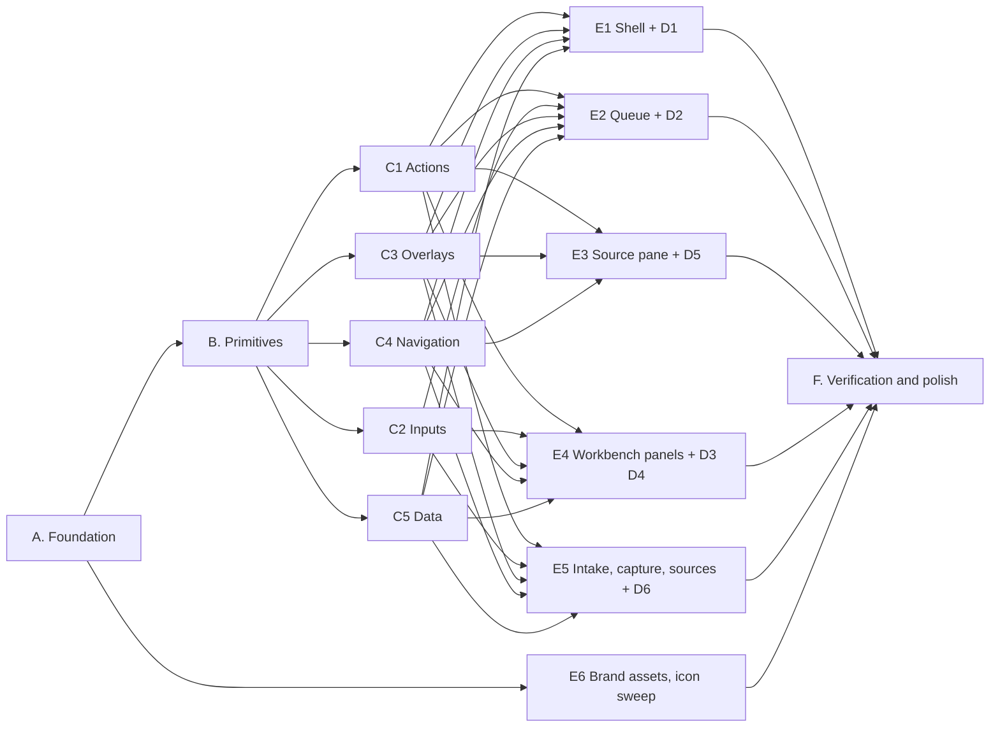

# Front-end refactor: building the `specimen_ui` design system

Status: **approved 2026-09-16; in progress.** Wave 0 is merged; see section 13
for the status log. Written 2026-09-16. Branch `front-end-refactor` (cut from
`main` at `f05d496`) in worktree `.claude/worktrees/front-end-refactor`. The
direction is [design/09-brand-direction.md](../../apps/specimen_digitization/design/09-brand-direction.md);
the library is [design/10-component-library.md](../../apps/specimen_digitization/design/10-component-library.md).
Read both before this document.

## 1. Goal and non-goals

**Goal.** Replace the client's presentation layer with the agreed brand
direction, delivered through an in-repo component library, across every
screen, on one integration branch, merged to `main` through one pull request
with every gate green and the visual and accessibility evidence regenerated.

**Non-goals.** No new product features, no API or wire changes, no change to
any honesty invariant (unmeasured stays unmeasured, no score without
components, no server-forbidden action enabled), no Flutter SDK upgrade, no
deployment. A UI defect already listed as open in
`design/08-verification-report.md` may be closed if the migration closes it
naturally; it is recorded, not sought.

## 2. Definition of done for the whole refactor

1. The `no_material_components` and `no_material_imports` backlogs are empty:
   zero Material component widgets outside `packages/specimen_ui`.
2. Geist and Geist Mono render everywhere; `google_fonts` is gone from
   `pubspec.yaml` and `pubspec.lock`.
3. Every glyph comes from `UiIcons` on Phosphor; `material_symbols_icons` is
   gone.
4. Every control in 10 section 4 exists, passes `expectControlContract`, and
   appears on its gallery page; the six gallery goldens exist in four
   combinations each.
5. The existing app suite is green with finders migrated to roles and labels;
   screen goldens and semantics fixtures are regenerated and their diff is
   reviewed and recorded.
6. `flutter analyze --fatal-infos` and `flutter test` pass in the app and in
   the package; `scripts/ci/check_ui_strings.py` reports zero violations;
   `flutter build web --release` and `scripts/ci/build_mobile.sh android`
   succeed; `scripts/ci/verify.sh` and `.github/workflows/ci-cd.yml` run the
   package tests.
7. Device captures of every top-level screen on an Android phone, an Android
   tablet in landscape and a desktop browser, in both modes, are checked in
   under `design/screenshots/refactor/`.
8. Launcher icons, splash, favicon and web manifest carry the pin mark.
9. `design/12-verification-report-v2.md` re-measures the eight dimensions of
   the north star bar against the rebuilt client.
10. Every agent session has appended its closeout to
    `docs/SESSION_LEARNINGS.md`.

## 3. Work breakdown

Sizes: S under half a day of agent time, M about a day, L more than a day.
"Retires" names the Material widget whose count in the gate backlog drops.

### A. Foundation (package `specimen_ui`)

| ID | Item | Output | Depends on | Size |
|---|---|---|---|---|
| A1 | Package skeleton | `packages/specimen_ui/` with pubspec, analysis options, top barrel, five empty family barrels, `CHANGELOG.md`; app path dependency | none | S |
| A2 | Fonts | Geist and Geist Mono bundled as package assets, OFL text in `LICENSES/`, `LicenseRegistry` registration, `FontVariation` helpers, `flutter_test_config.dart` loading them; `google_fonts` removed | A1 | S |
| A3 | Colour tokens | `palette.dart`, `color.dart` (ground, ink, hairline, boundary, disabled, scrim, accent per mode; status triples carried from v1) | A1 | M |
| A4 | Fields and glass tokens | `fields.dart` (five fields, three sky presets), `glass.dart` (three levels, `GlassQuality`) | A3 | S |
| A5 | Type tokens | `type.dart` roles per 09 section 4.2, mono roles, `TextTheme` bridge | A2 | S |
| A6 | Shape, space, density | `shape.dart` (superellipse radii, strokes), `space.dart` (v1 grid), `density.dart` (values, `Density` widget, pointer probe) | A1 | S |
| A7 | Motion tokens | `motion.dart` carried from `lib/src/theme/motion.dart` and `motion_preference.dart`, plus the three signature durations | A1 | S |
| A8 | Icons registry | `icons.dart`: `UiIcons` on `phosphor_flutter`, the product meanings table, weight policy; appendix A mapping as a Dart map for the codemod | A1 | S |
| A9 | Theme assembly | `theme.dart`: `UiThemeData.light()`/`.dark()`, `UiTheme` widget, `context.ui`, `toThemeData()`; wired in `main.dart` | A3 to A8 | M |
| A10 | Gates | `no_color_literals` (moved), `no_material_components`, `no_material_imports`, `glass_budget`, `layering`, `icons_unique`, `fonts_bundled`, `contrast_composite`, `no_dashes`, with initial backlog maps computed from the tree | A9 | M |
| A11 | Gallery shell and foundation page | `lib/src/gallery/`, `UiGallery`, the type specimen (including `0O 1lI 5S 2Z 8B`), colour, field, glass, shape and icon pages; `/gallery` route in the app for non-release builds; golden test | A9 | M |
| A12 | Test harness | `test/harness/control_contract.dart` (`expectControlContract`), gallery golden harness (light, dark, touch, pointer) | A9 | M |
| A13 | CI | `scripts/ci/verify.sh` and `ci-cd.yml` run `flutter analyze` and `flutter test` in the package; `check_ui_strings.py` scans the package | A1 | S |

### B. Primitives

| ID | Item | Retires | Depends on | Size |
|---|---|---|---|---|
| B1 | `Pressable` and `StateLayer` | `InkWell`, `InkResponse`, `Material` at call sites | A9, A12 | M |
| B2 | `Surface`, `GlassSurface`, `Scrim` | `Card` (as a container) | A4 | M |
| B3 | `FieldLayer` | none (new) | A4 | S |
| B4 | `FocusRing`, `Squircle` | none | A6 | S |
| B5 | `Popover` | none (base of menus and selects) | B1 | M |
| B6 | `ModalRoutes` (`showUiSheet`, `showUiDialog`, `showUiModal`) | `showDialog`, `showModalBottomSheet` | B2 | M |
| B7 | `FieldCore` | `TextField` chrome | B4 | M |
| B8 | `Announcer`, `Density` wiring at the app root | none | A6 | S |

### C. Controls, by family

| ID | Family and controls | Retires | Depends on | Size |
|---|---|---|---|---|
| C1 | Actions: `UiButton`, `UiIconButton`, `UiCapsuleToggle`, `UiChip`, `UiSegmented`, `UiBadge`, `UiKeyCap` | `FilledButton`, `OutlinedButton`, `TextButton`, `IconButton`, `Chip` family, `SegmentedButton`, `Badge` | B1, B4 | L |
| C2 | Inputs: `UiField`, `UiTextArea`, `UiSearchField`, `UiSelect`, `UiSwitch`, `UiCheckbox`, `UiRadio` | `TextField`, `TextFormField`, `DropdownMenu`, `Switch`, `Checkbox`, `Radio` | B1, B5, B7 | L |
| C3 | Overlays: `UiPopoverMenu`, `UiTooltip`, `UiToast`, `UiBanner`, `UiDisclosure`, `UiTabs`, `UiSheet`, `UiDialog` | `MenuAnchor`, `PopupMenuButton`, `Tooltip`, `SnackBar`, `ScaffoldMessenger`, `ExpansionTile`, `TabBar`, `AlertDialog` | B1, B2, B5, B6 | L |
| C4 | Navigation: `UiPillNav`, `UiRail`, `UiSidebar`, `UiTopBar`, `UiScaffold` | `NavigationBar`, `NavigationRail`, `Drawer`, `AppBar`, `Scaffold` | B1, B2, B3 | L |
| C5 | Data: `UiListRow`, `UiProgress`, `UiSkeleton`, `UiEmptyState`, `UiDataTile`, `UiArcIndicator`, `UiAvatar`, `UiHairline` | `ListTile`, `CircularProgressIndicator`, `LinearProgressIndicator`, `Divider` | B1, B2 | L |

Each family delivers its controls, their style objects, behaviour tests,
`expectControlContract` runs, its gallery page and the family golden, and a
changelog entry. Families touch only their own directory, their own barrel,
their own gallery page and their own golden files.

### D. Patterns (app `lib/src/widgets/`), public API unchanged

| ID | Patterns | Built from | Owner slot | Size |
|---|---|---|---|---|
| D1 | `StatusChip`, `NotCalibratedChip`, `TermText`, `CaveatText`, `EnvironmentBanner`, `Skeleton`, `EmptyState`, `KeyCap`, `InFlightGlyph`, `MotionReveal` | C1, C3, C5 | E1 shell agent | M |
| D2 | `QueueRow`, `SelectionBar`, `Thumbnail` | C1, C5 | E2 queue agent | M |
| D3 | `ReadingCard`, `AuthorityCandidateCard`, `DiffText`, `FieldRow`, `EvidenceDrawer` | C3, C5, `Surface` | E4 workbench panels agent | L |
| D4 | `RiskMeter`, `ReasonSheet`, `AdaptiveForm` | C2, C3, C5 | E4 workbench panels agent | M |
| D5 | `RegionOverlay`, `MeasuredHeight` | tokens | E3 source pane agent | S |
| D6 | `UploadItem`, `SourceObjectRow`, `SourceImportSheet` | C1, C3, C5 | E5 intake agent | M |

A pattern keeps its constructor and named parameters in this refactor so its
consumers on other agents' screens do not change. Any pattern with a
justified API change is done by its owner in a later wave with all consumers.

### E. Screens

| ID | Screen slot | Files | Retires (from appendix B) | Depends on | Size |
|---|---|---|---|---|---|
| E1 | Shell and entry: `app/shell.dart`, `app/app_router.dart`, `app/auth_layout.dart`, `app/setup_screen.dart`, `app/help_screen.dart`, `magic_link_screen.dart`, `email_verification.dart`, `administrator_contact.dart`, `main.dart` theme wiring, D1 | see appendix B | C1, C3, C4, C5 | L |
| E2 | Queue: `screens/queue/queue_screen.dart`, `screens/queue/workbench_screen.dart` (the route shell only), `search_filters.dart`, `saved_filters.dart`, `selection.dart` consumers, D2 | see appendix B | C1 to C5 | L |
| E3 | Workbench source side: `screens/workbench/source_pane.dart`, `region_editor.dart`, `source_pixels.dart`, D5 | see appendix B | C1, C3, C4 | L |
| E4 | Workbench panels: `screens/workbench/readings_panel.dart`, `fields_panel.dart`, `status_strip.dart`, `decision_bar.dart`, `shortcuts.dart`, `workbench.dart`, `evidence_panel.dart`, `operational_panel.dart`, `audit_history.dart`, `review_context.dart`, `large_record.dart`, `reading_alignment.dart`, `risk_assessment.dart`, `reading_declarations.dart`, D3, D4 | see appendix B | C1 to C5 | L |
| E5 | Intake, capture, sources: `intake.dart`, `screens/intake/*`, `capture/*`, `screens/sources/*`, `sources.dart`, `capture_quality.dart`, D6 | see appendix B | C1 to C5 | L |
| E6 | Brand assets and icon codemod remainder: launcher icons, splash, favicon, manifest, the pin SVG, the `Symbols.` to `UiIcons` sweep for glyphs no screen agent owns, `material_symbols_icons` removal | `Symbols.` backlog | A8, E1 to E5 for the final sweep | M |

Each screen slot also migrates the tests that exercise its files from Material
type finders to role and label finders, and leaves screen goldens and
semantics fixtures untouched for the integrator.

### F. Verification and polish

| ID | Item | Depends on | Size |
|---|---|---|---|
| F1 | Golden and fixture regeneration per wave, moved-set review, `glass_budget` and `contrast_composite` on the real screens | each wave | S per wave |
| F2 | Motion signature and reduced-motion pass; dark-mode QA on device; `GlassQuality` default per platform from measurement | E1 to E6 | M |
| F3 | Device captures under `design/screenshots/refactor/` and the web smoke | E1 to E6 | S |
| F4 | `design/12-verification-report-v2.md`; `design/README.md`, `05`, `07` deltas (pill navigation, superellipse, density) | F1 to F3 | M |
| F5 | `no_literal_geometry` gate introduced with backlog and driven to zero | E1 to E6 | M |

### G. Fit (waves F and G, inserted before wave 3 on 2026-09-16)

Checkpoint 1 review found three composition defects (a three edged focused
field, labels wrapping letter by letter in narrow columns, overlay text in the
framework fallback style). `design/11-fit-and-scale.md` gives the causes, the
rules and this breakdown. Wave 3 waits for both waves because its screens are
mostly fields and rows of actions.

| ID | Scope | Depends on | Size |
|---|---|---|---|
| F1 | `fe/fit-fields`: `FieldCore` paints text only; `UiFieldBox` paints the one edge; `FocusRing` follows the shape; fields ring on any focus; inputs gallery states; the edge count test (11 section 4) | wave 1.5 | L |
| F2 | `fe/fit-foundation`: `WindowClass` and `Adaptive` in the package; scaled line height and strut on the type scale; `UiTheme` publishes `DefaultTextStyle`; overlay frames re-publish it; `FitBuilder` and label measurement; `no_fallback_text_style`; harness clauses 13 to 15; root text scale clamp (11 sections 2, 3.1, 5) | wave 1.5 | L |
| G1 | `fe/fit-actions`: segmented, button, chip fit variants; `UiButtonRow`; actions gallery | F1, F2 | M |
| G2 | `fe/fit-surfaces`: top bar, tabs, tile, row, dialog, sheet, banner, toast fit variants; their galleries | F1, F2 | L |
| G3 | `fe/fit-gallery`: compact gallery shell; Fit page; golden matrix (four classes by three scales by two modes) | F1, F2 | M |

### H. Composition (wave A, added 2026-09-17 after the emulator review)

The record screen on an Android phone showed the controls right and the
screen wrong: a scroll inside a scroll, chrome taking about three quarters of
the height, surfaces inside surfaces, nothing prioritised.
`design/13-screen-composition.md` names the causes, states the composition
contract and turns it into tests.

| ID | Scope | Depends on | Size |
|---|---|---|---|
| A1 | `fe/compose-package`: `UiCollapsingHeader`, `UiStatusStrip`, `UiDecisionBar`, `UiBanner.strip`, `UiScaffold` by route, the `PinnedChrome` and `PrimaryRegion` markers, the action bar hook, a Composition gallery page | H1 | L |
| A2 | `fe/compose-record`: the record screen and region editor rebuilt as one scroll with a collapsing source header, status strip, sticky segments and a one row decision bar (13 sections 4.1, 4.3) | A1 | L |
| A3 | `fe/compose-shell`: the shell's band strip, pill by route and top bar by route; queue, intake, sources, sign in, help and setup as one scroll each (13 sections 4.2, 4.4 to 4.6) | A1 | L |
| A4 | `fe/compose-gates`: `test/composition/*` (no nested scrollables, surface depth, chrome budget, above the fold, one job) with per screen expectations, and the emulator and simulator capture script | H1 | M |

### I. Release readiness for a live data pilot (wave B, added 2026-09-17)

Anurag asked for the client to be ready to test on live data: CI/CD fully
green, the deployment path fully checked, documentation and lessons in order.
The deployment rules in `docs/DEPLOYMENT.md` bind: a merge to `main` is the
only production trigger, pull requests cannot deploy, and no deploy command
runs from a workstation or agent shell. The live data pilot itself is gated by
`docs/execution/CURRENT_RELEASE_CHECKLIST.md`, whose open items (protected
DATA initialisation, runtime authorisation, App Check, credential lifecycle,
the pending USD12 ceiling decision) are the user's and protected CI's, not a
front end slot's; wave B prepares everything on the client's side and writes
the runbook for the rest.

| ID | Scope | Depends on | Size |
|---|---|---|---|
| B1 | `fe/release-ci`: every gate this refactor added runs in `scripts/ci/verify.sh` and `.github/workflows/ci-cd.yml` (package tests, formatting, literal geometry, composition once A4 lands); a web smoke over the release build's routes in CI; the deployment marker and public settings path checked against the new client; a release candidate report | H1 | M |
| B2 | `fe/release-docs`: README (root and app), `docs/DEPLOYMENT.md` client section, `design/README.md`, the plan's definition of done table, the package CHANGELOG as 0.3.0 release notes, and `docs/LESSONS_FRONT_END_REFACTOR.md` distilled from every closeout | none | M |
| B3 | `fe/release-client`: the client against live data shapes: wire contract tests against the runtime API schema, real data shaped fixtures (long labels, many regions, missing measurements, large photographs), the environment band states of 07 section 1.3 for the pilot, error and connectivity screens of 07 section 11, image memory on real photographs; `docs/execution/CLIENT_LIVE_DATA_READINESS.md`, the runbook of what is verified and what remains for the user | none | L |

## 4. Dependency graph



## 5. Waves, agents and models

At most four agents run at once: this machine already hosts other worktrees
and long `flutter test` runs get reaped under load (see
`docs/SESSION_LEARNINGS.md`, 2026-09-14 entries). Taste-heavy slots run on
Opus; codemod-shaped slots may run on Sonnet.

| Wave | Slots (branch) | Agents | Model | Exit criterion |
|---|---|---|---|---|
| 0 | A1 to A13 and B1 to B8 (`fe/foundation`) | 1 | Opus | Package builds; gates in place with backlogs; foundation gallery page golden; `Pressable` and `GlassSurface` visible on the gallery; app still green with `UiTheme` wrapping it |
| 1 | C1 `fe/actions`, C2 `fe/inputs`, C3 `fe/overlays`, C4 `fe/navigation`; then C5 `fe/data` as the first slot frees | 4, then 1 | Opus | Five family goldens in four combinations; every control passes the contract; **checkpoint 1** |
| 2 | E1 `fe/shell`, E2 `fe/queue`, E6 `fe/brand-assets` | 3 | Opus, Opus, Sonnet | Shell and queue on the new system at all four window classes; app icons replaced; **checkpoint 2** |
| 3 | E3 `fe/source-pane`, E4 `fe/workbench-panels`, E5 `fe/intake-sources` | 3 | Opus | Backlogs at zero except the final icon sweep; all app tests green |
| 4 | F1 to F5 (`fe/verification`, `fe/polish`) | 2 | Opus, Sonnet | Definition of done, section 2, every line |

Waves run back to back. Each checkpoint produces artifacts for review (section
10); Anurag can halt or redirect at any of them, and absent a message the next
wave starts.

## 6. Branch, worktree and merge protocol

- `front-end-refactor` is the integration branch. Agents never commit to it.
- The integrator cuts each slot from the current `front-end-refactor` head:
  `git -C <repo> worktree add -b fe/<slot> <repo>/.claude/worktrees/fe-<slot> front-end-refactor`,
  copies `lib/firebase_options.ci.dart` to `lib/firebase_options.dart`
  (gitignored) in it, and hands the agent that absolute path.
- An agent works only inside its worktree and only on the files its slot owns
  (section 3 and appendix B). It does not run `--update-goldens` on
  `test/golden/images/` or `test/accessibility/fixtures/`; family gallery
  goldens under the package are its own. It does not edit another slot's
  family barrel, `pubspec.lock` (unless its brief adds a dependency), or any
  region of `docs/SESSION_LEARNINGS.md` other than its own appended entry.
- Before handing back, the agent runs the gates in section 7 one at a time,
  leaves the tree untouched while each runs, and reports each gate's own exit
  code. It then commits, pushes `fe/<slot>`, appends its closeout entry, and
  reports: files changed, tests added, goldens added or moved, backlog counts
  before and after, anything left undone.
- The integrator fetches, merges with `git merge --no-ff fe/<slot>` in the
  integration worktree, resolves conflicts (expected only in family barrels,
  `CHANGELOG.md` and `pubspec.yaml`; `SESSION_LEARNINGS.md` is `merge=union`),
  runs the gates, regenerates screen goldens and fixtures once per wave,
  reviews the moved set against the set expected, pushes
  `front-end-refactor`, and removes the slot worktree.
- One pull request from `front-end-refactor` to `main` at the end, carrying
  the verification report. Nothing is deployed by hand; Hosting follows
  `ci-cd.yml` after merge per `AGENTS.md`.

## 7. Gates and commands

Run from the slot worktree, one at a time, with the locale exported and the
placeholder Firebase options in place. Never through a pipe whose exit code
you then read; capture `rc=$?` directly (`status` is read-only in zsh).

```bash
export LANG=en_US.UTF-8 LC_ALL=en_US.UTF-8
cd <worktree>/apps/specimen_digitization
cp lib/firebase_options.ci.dart lib/firebase_options.dart
flutter pub get --enforce-lockfile
flutter analyze --fatal-infos
(cd packages/specimen_ui && flutter analyze --fatal-infos && flutter test)
flutter test
cd <worktree>
uv run python scripts/ci/check_ui_strings.py --baseline scripts/ci/ui_strings_baseline.txt
uvx --from pre-commit==4.5.1 pre-commit run --files <changed files>
```

During development an agent runs targeted tests (`flutter test test/controls/button_test.dart`)
and the full suites once at the end. `flutter build web --release` and
`scripts/ci/build_mobile.sh android` run in wave 4 and before the final PR.

## 8. Golden and fixture policy

- Package gallery goldens: owned by the family that renders them; regenerated
  by that agent; reviewed by eye in the integrator's merge.
- App screen goldens (`test/golden/images/`, 105 files) and semantics fixtures
  (`test/accessibility/fixtures/`): regenerated only by the integrator, once
  per wave, on macOS, with `flutter test --update-goldens test/golden` and
  `flutter test --update-goldens test/accessibility`. The set that moved is
  compared with the set expected to move, and unexpected movement is a
  finding. Two branches that both regenerate binaries can silently revert one
  another, so no agent branch may contain a regenerated screen golden.
- Every golden in the app renders in Geist once A2 lands, so the wave 0 merge
  moves all 105 screen goldens exactly once. That regeneration is the
  baseline for every later diff.

## 9. Risks and mitigations

| Risk | Mitigation |
|---|---|
| `BackdropFilter` cost on Android tablets and web | `glass_budget` gate; `GlassQuality` with a measured per-platform default; no glass in scrolling items; fields static under a `RepaintBoundary` |
| Text on glass over a field fails contrast | `contrast_composite` gate over the extremes of every field; ink text only; glow only on hero numerals in light |
| Parallel agents collide on shared files | Family barrels, per-slot ownership in appendix B, patterns keep their public API, integrator owns screen goldens and fixtures |
| Machine load reaps long test runs | Four agents maximum; targeted tests during development; one full run at the end with the tree untouched; log to a file and poll |
| The pinned SDK | Only `widgets.dart` primitives and packages verified to resolve on 3.38.5 (`phosphor_flutter` 2.1.0, `flutter_launcher_icons` 0.14.4, `flutter_native_splash` 2.4.8); no shadcn-style library (none resolves at a current version) |
| Geist Mono's zero or `1lI` not distinct | The type specimen golden in A11; enable the stylistic set that fixes it or keep JetBrains Mono for `mono.literal` only |
| Screen tests coupled to Material types | Each screen slot migrates its finders to roles and labels as part of the slot |
| Honesty invariants regress during migration | Wire tests and the accessibility guideline tests stay in the suite; the semantics fixture diff is reviewed per wave |
| Scope creep into features | Section 1 non-goals; a screen agent that finds a product defect records it in its closeout instead of fixing it |
| Two glyphs for one meaning after the icon sweep | `icons_unique` gate; appendix A is the single mapping |

## 10. Review checkpoints

| Checkpoint | After | What Anurag sees | Decision |
|---|---|---|---|
| 0 | this document | 09, 10, this plan | Approve the plan, or edit it |
| 1 | wave 1 | The six gallery goldens (PNGs sent to the conversation) and `flutter run -d chrome` at `/gallery` | Continue to screens, or adjust tokens or a control first |
| 2 | wave 2 | Queue and shell at four window classes in both modes, the new app icon | Continue, or adjust the screen direction |
| 3 | wave 3 | Every screen; the verification report draft | Continue to polish |
| 4 | wave 4 | The pull request to `main` with the report | Merge |

## 11. Agent brief template

Every brief contains, in this order:

1. **Read first.** `AGENTS.md`, `CLAUDE.md` at the repository root,
   `design/00-north-star.md`, `design/02-ux-writing-guidelines.md`,
   `design/04-motion-and-microinteractions.md`, `design/06-accessibility.md`,
   `design/09-brand-direction.md`, `design/10-component-library.md`, this
   document, and the `docs/SESSION_LEARNINGS.md` entries dated 2026-09-14
   about running gates on this machine.
2. **Slot.** The IDs from section 3, the exact files and directories owned,
   and the files explicitly forbidden.
3. **Contracts to honour.** The token accessors in 10 section 1.4, the control
   contract in 10 section 2, the anatomy entries in 10 section 4 for each
   control in the slot, and the public APIs of any pattern the slot consumes
   but does not own.
4. **Definition of done.** 10 section 9 per control, plus the slot's exit
   criterion from section 5.
5. **Gates.** Section 7, run individually, exit codes reported.
6. **Handback.** Push the branch, append the closeout, report as in section 6.
7. **Forbidden.** Touching `main` or `front-end-refactor`; regenerating screen
   goldens or fixtures; editing another slot's files; adding a dependency not
   named in the brief; any deploy or cloud command; em or en dashes in strings
   or documents; waiting on a question overnight when a reasonable assumption
   can be recorded in the closeout instead.
8. **Load discipline.** Targeted tests while developing; one full run at the
   end with the tree untouched; log to a file and poll it.

## 12. Size

The package lands at roughly nine to twelve thousand lines including tests
and gallery. The screen migration touches roughly twelve thousand lines of
existing Dart, mostly replacements at call sites, plus test finder changes.
About sixteen agent runs across five waves; two to three days of wall clock
with the concurrency cap, dominated by full test runs.

## 13. Status log

| Date | Event |
|---|---|
| 2026-09-16 | Plan approved in chat. |
| 2026-09-16 | Wave 0 (`fe/foundation`, 15 commits, 60f8fb4) merged into `front-end-refactor` as e9228cf. Gates rerun by the integrator: app analyze, package analyze, package tests (111), app tests (1062 passed, 7 skipped), string lint, all exit 0. All 121 screen goldens moved once (they rendered in Ahem before, not the platform sans); zero semantics fixtures changed. Six colour tokens corrected against 09 section 3.7 and recorded in 09; `UiButton.primary` inverts with the mode; the state layer is `ink` in both modes (10 amended). Gate backlogs at the start of wave 1: `no_material_components` 208 uses over 50 files, `no_material_imports` 43 files, `icons_unique` 161 glyphs over 43 files. |
| 2026-09-16 | Wave 1, `fe/actions` (581e7dd, 6 commits) merged as 9642b8d, gates green (package 189 tests). Foundation changes carried: an optional state layer colour on `Pressable` and `StateLayer` (an `ink` layer over an `ink` fill was invisible), and `familyPages` in the gallery shell so registering a family page does not move the 24 foundation goldens. |
| 2026-09-16 | Wave 1, `fe/overlays` (969b66e, 11 commits) merged as 05a69c6 after union-resolving `gallery_shell.dart` and `CHANGELOG.md`; its four dark goldens re-rendered by the integrator in d78bcd5 because the merged tree carries the completed `UiButton`, whose dark secondary fill changed (masked diffs show the three secondary buttons and nothing else). Foundation changes carried: `Popover` `surface` and `interactive`, non-uniform pane corners on `Squircle` and `GlassSurface`, and `ModalRoutes` now dismisses on Escape and returns focus to the trigger, which no modal in the product did before. |
| 2026-09-16 | Wave 1, `fe/inputs` (b29cfc2, 13 commits) merged as 2d24525, gates green (package 274 tests, app 1062 passed and 7 skipped). Foundation changes carried: `FieldCore.excludeFromSemantics`, and a `ControlActivation` mode in the control contract because a text field must not consume Space. Two families remain: navigation and data. |
| 2026-09-16 | Wave 1, `fe/navigation` (05bdc2a, 6 commits) merged as 7fb9650. Its measured field geometry (radius bound to the longer side, Gaussian falloff, 32 stops; 09 section 3.2 amended) moves the sky behind every gallery page, so the integrator re-rendered all 20 family and foundation goldens that had not already moved on that branch (c1a78a2). Two integration defects fixed on the way: the union merge had kept a second one-line `familyPages` declaration that `dart format` had produced on the navigation branch (resolver now normalises to one canonical list), and the shell's sidebar overflowed a 600 px window with ten pages, caught by the app's gallery route test (3b8e03a makes the list scroll; goldens unchanged). Gates green at 3b8e03a: package tests 423, app 1062 passed and 7 skipped. One family remains: data. |
| 2026-09-16 | Wave 1, `fe/data` (8a7b420, 7 commits) merged as 50b7154; its four goldens re-rendered against the new sky in 80fa279. Gates green at 80fa279: package tests 505, app 1062 passed and 7 skipped. **Wave 1 complete: all five families integrated.** Stand-ins marked `TODO(fe/...)` and the package test harness fix are handled by a short integration-polish slot (`fe/polish`) before checkpoint 1's web build; the family goldens were sent for review at this point. |
| 2026-09-16 | Wave 1.5, `fe/polish` (93e3253, 11 commits) merged as cbd74bb, gates green (package 519 tests, app 1062 passed and 7 skipped). Every `TODO(fe/...)` stand-in swapped for the real control and a `no_stand_ins` gate added; the package test harness publishes `UiTheme`, `Density` and `MediaQuery` above the navigator with a proof test; 10 reconciled with what the five families shipped (38 amendments); `specimen_ui` 0.2.0. Follow-ups for a later polish: a disabled `Pressable` reports no hover, so its reason shows on press and in semantics but not on hover alone; `UiListRow` has no `tone`, so `UiPopoverMenu` items stay private rows. `fe/brand-assets` (E6, assets half) in progress; it was interrupted once by a transient HTTP 529 and resumed. Wave 2 slots E1 (`fe/shell`) and E2 (`fe/queue`) cut from cbd74bb. |
| 2026-09-16 | E6 assets half, `fe/brand-assets` (c1620b0, 8 commits, 110 files) merged as 7beda85, gates green (package 513 tests, app 1062 passed and 7 skipped, `build web --release`, `build_mobile.sh android` with the adaptive icon and splash drawables verified in the APK, an iOS build whose asset catalogue lists the icon and launch images). The pin mark exists as `assets/brand/pin.svg`, a reproducible generator `tool/brand/render_mark.py`, launcher icons on all three platforms, the splash, the web manifest and favicon, and `UiMark` in the package. `flutter_native_splash` is 2.4.7, not 2.4.8, which needs a `meta` the pinned `flutter_test` forbids; 09 section 9 amended. The tool bug that rewrites unrelated `ASSETCATALOG` build settings was reverted before commit. **Checkpoint 1 delivered:** the family goldens and the browsable profile build of `/gallery` (release builds exclude the route by design). The icon sweep (E6's other half) waits for waves 2 and 3. |
| 2026-09-16 | Wave 2, `fe/queue` (683af7d) merged as 04e4708 and its goldens and fixtures regenerated in baf0f6f; gates green at baf0f6f. `fe/shell` (8833de7) merged as a8561a0 with the three gate backlog maps intersection resolved; copy fix c412bf1 (the chip says "Needs review", 02 section 4.13); regeneration 81a64fb moved 111 of 121 screen goldens and 5 fixtures. Three app tests then failed because the shell turned the queue's static placeholder into the pulsing `UiSkeleton` and its indicators into `UiProgress`; fixed in 31ffbff (the fixture harness can skip settling; the first load test looks inside `QueueScreen`). Gates green at 31ffbff (package 513 tests, app 1062 passed and 7 skipped); pushed. **Wave 2 complete.** `fe-shell` and `fe-queue` retired. |
| 2026-09-16 | Checkpoint 1 review in chat: a three edged focused field, labels wrapping letter by letter at narrow widths, yellow double underlines in overlays. Root causes and rules written as `design/11-fit-and-scale.md`; 09 section 3.6 and 10 sections 2, 4, 6 and 8 amended; section 3G above added and the verification report renumbered to 12. Waves F (F1, F2) and G (G1 to G3) run before wave 3. Defects recorded for polish 2: the shell's busy strip is a live region ("Loading collection data") while the queue announces "Loading queue", a double announcement on first load. |
| 2026-09-16 | Wave F. `fe/fit-foundation` (5993f0b, 8 commits) merged as 4f90f08 with every gallery golden re-rendered (even leading moves all 48); `fe/fit-fields` (c0bd6ba, 6 commits) merged as f70ef09 after splicing its clause 4 (a text editing control rings for any focus) into the foundation's harness that adds clauses 13 to 15; integration eceef5a closes the two cross slot markers through `UiType.lineHeightAt` and `controlHeightAt` (scaler forms added so `UiInputStyle.resolve` shares the one geometry source) and corrects 11 to name `MaterialApp` as what installs the fallback style; inputs and primitives goldens re-rendered; screen goldens and fixtures regenerated in a301748 ( 73 files changed, 12 insertions(+), 26 deletions(-)). Gates green at a301748; pushed. **Wave F complete.** Wave G cut from a301748: `fe/fit-actions`, `fe/fit-surfaces`, `fe/fit-gallery`; `fe/fit-gates` (cut from bd69f80) runs beside them. |
| 2026-09-16 | G4 `fe/fit-gates` (6c69714, 4 commits) merged as d0f5af0: `no_literal_geometry` as two gates, the package allowing nothing outside the foundation, the gallery and painters, the application against a backlog of 26 numbers over 9 files (ten of them elapsed time such as request timeouts, which become named constants where the policy lives, not motion tokens). The five package offenders it recorded (tooltip hover delay and touch window, toast stay, the two modal entrance rises) are named on `MotionTokens` in 5d93e25 and the handoff list is empty. Gates green at 5d93e25; pushed. |
| 2026-09-16 | Wave G. `fe/fit-actions` (8bd401f, 9 commits) merged as 4a2f626; `fe/fit-gallery` (297a1d5, 5 commits) merged as a52d5fd; `fe/fit-surfaces` (bf8742b, 9 commits) merged as f66ad8c. Integration 967c9d1: `UiModalActions` forwards to `UiButtonRow`, `UiListRow` bounds an unmeasurable trailing (the one overflow the matrix still saw, 118 dp at 360), `GalleryColumns` stacks page columns at phone width, `fitColumns` shared, the two foundation gallery pages fixed (d886a51), overflow backlog empty because the matrix sees none. 9c72d25 formats the whole tree once and the gate run checks formatting from here on. Screen goldens and fixtures regenerated in b15dd64; package 670 tests, app suite green. **Waves F and G complete: every control has a fit policy, every page renders at four classes by three scales by two modes (288 matrix goldens).** Open for polish 2: a declared trailing-under-title row variant; the banner's two line cap (V-15) against 11's wrapping rule; `shell.dart` onto `UiTopBarAction` and `UiBanner(actionLabel:)`; `StatusChip` onto `UiChip.leading`. |
| 2026-09-17 | Wave 3 and polish 2. `fe/intake-sources` (4e6ff79, 5 commits) merged as 29f1329; `fe/source-pane` (a13bc0f, 6 commits) merged as 98398ad; `fe/polish-2` (87bae53, 17 commits, 123 files) merged as 7d0d8fa; `fe/workbench-panels` (55bf7dd, 4 commits) merged as e6574c2. Backlog maps resolved by intersection at each merge (`resolve_backlog.py`); the two tests both wave 3 slots touched take the workbench slot's helpers. Every screen is on the design system: the `no_material_components`, `no_material_imports`, `icons_unique` and `no_literal_geometry` backlogs lose every wave 3 file; the tap target skip list is empty. Polish 2 closed: disabled `Pressable` hover, `UiListRow` tone and its trailing under the title variant, a silent shell strip with the queue's announcement keyed on the collection, the shell's adapters retired onto `UiBanner(actionLabel:)`, `UiChip.leading` and `UiTopBarAction`, gallery copy, a plain node for a row with nothing to do, `UiDataTile.surface` for list headers, `UiDisclosure` at 48 dp, `UiScaffoldExclusion` for the photograph's clear band, `SkyPreset.work` on the record route; declined a static loading indicator (04 section 2.5 keeps indeterminate motion). Findings recorded for cleanup and later: `_CountTile` and `disclosureStyleWithFullTarget` and `fullTargetDisclosure` markers retire with the cleanup slot; `UiListRow` switches variants about 27 dp early (a double subtraction of padding and bar gutter, conservative, contract test calibrated to it); wave 3 package API requests listed in the closeouts (a routed screen filling `UiScaffold.actionBar`, `UiButton` drawing its disabled reason, an action chip, a selected edge on `Surface`, a status colour on `UiArcIndicator`, a label slot on `UiDataTile`, modal routes above the keyboard, `scrollBody` on `UiDialog.showAdaptive`, a widgets layer selectable text). Screen goldens and fixtures regenerated in b818859 (moved set reviewed by each slot at handback and by the integrator at the merge); import hygiene 0d9a5e7. Gates green at 0d9a5e7 (package 684 tests; app suite green; formatting, strings and literal geometry gates green). **Wave 3 complete: every screen is on the design system.** Cleanup (H1) and verification (H3) cut from 0d9a5e7. |
| 2026-09-17 | H1 `fe/cleanup` (304e612, 5 commits, 38 files, 8 deleted) merged as 369f0b9: the last 17 Material glyphs and the `SpecimenIconography` adapter gone with `lib/src/theme/icons.dart`; `material_symbols_icons` and `cupertino_icons` out of the pubspec; the six v1 theme adapters deleted and `AppTheme` reduced to `UiThemeData.toThemeData()` plus text selection and page transitions; the last `Scaffold` out of `app_router.dart`; the three `fe/polish-2` markers retired onto `UiDataTile(surface: paper)` and the 48 dp `UiDisclosure`; both Material gates widened to all of `lib/`. Backlogs: `icons_unique` 0, `no_material_components` 0, `no_material_imports` 0 (four named infrastructure importers with reasons), `no_literal_geometry` 10 numbers over 3 files, all elapsed times. Zero screen goldens or fixtures moved. `flutter build web --release` 25 s, `main.dart.js` 3,272,384 bytes; `build_mobile.sh android` 69 s, debug APK 163,930,510 bytes. Gates green at 369f0b9: package 684 tests, app 1097 passed and 7 skipped, formatting, strings and literal geometry green; pushed. **Definition of done items 1 to 6 and 8 met; 7 and 9 with H3.** Open: `SourceMatte`'s painted band onto `UiScaffoldExclusion`, `AppShell.skyOf` into `routes.dart`, a package `UiPageRoute` to retire the last `material.dart` import in a screen file. |
| 2026-09-17 | H3 `fe/verification` (6acdcab, 4 commits) merged as 8fcb41e: `design/12-verification-report-v2.md`, 43 device captures under `design/screenshots/refactor/` (Android phone emulator, iPad Pro 13 simulator standing in for the tablet class, desktop browser; no landscape and no `large` device capture, recorded), the fit matrix (132 cells: 123 intended, 9 squeezed, 0 overflow), reduced motion (10 of 14 collapse), dark mode over 40 cells with the accent at exactly one mark per screen, glass measured on three surfaces (`GlassQuality.full` stays the default), web smoke clean. Two bar dimensions moved down to Partial (visual system, motion); usability recorded as not re-measured. Six defects, none fixed by the slot; three fixed in 4973420 on the integration branch: V2-1 the field painter now clips to its bounds (the sky bled over the environment band, 3.31:1 on sign in), with a test that rasterises past the bounds; V2-3 the queue list adds the scaffold's navigation clearance so the last row scrolls clear on a phone; V2-6 every page transition collapses under reduced motion. Open: V2-2 `ink.tertiary` at 3.29:1 over the sun field (every contrast table is taken over the three opaque surfaces and the sky composites on all of them; a token decision), V2-4 the sources screen has no page heading, V2-5 `enum FieldLayer` in `field_row.dart` collides with the package widget's name; plus the cleanup slot's three follow-ups. `origin/main` merged into the branch (d4830ce, CI scripts and docs only). The three fixes moved 26 gallery goldens (navigation specimens whose sky had spilled past their boxes, re-rendered in d116dbb) and the entry screen goldens (09e9808); the instruments that pinned the defects pin the healthy values now (a4cd400). **Gates green at a4cd400: package 685 tests, app 1301 passed and 7 skipped, formatting, strings and literal geometry green; pushed. Pull request #64 to `main` marked ready.** |
| 2026-09-17 | Pull request #64's first CI run failed one job, "Flutter checks and web build": all 336 package goldens differ on the Linux runner by one to eleven percent of pixels, the same font rasterisation gap the application's screen goldens already skip off macOS. `PlatformGatedGoldenComparator` in the package's `flutter_test_config.dart` compares on macOS only, renders elsewhere, and refuses to write goldens off macOS; both paths proven locally (`SPECIMEN_UI_GOLDENS=skip` forces the off macOS path). Package suite 685 green; pushed for CI to rerun. |
| 2026-09-17 | Morning review on the Android emulator: the record screen at phone width has a scroll inside a scroll, chrome at about three quarters of the height, surfaces inside surfaces and no priority; Anurag asked for the screens fixed end to end and the client made ready to test on live data with CI/CD green, deployments checked and documentation and lessons in order. `design/13-screen-composition.md` written (composition contract, patterns, per screen tables, gates); sections 3H and 3I added; wave A (A1, A4 first, then A2, A3) and wave B (B1 to B3) cut from this commit. |
| 2026-09-17 | Second CI run on the pull request: the package goldens pass on Linux with the comparator, and 20 application tests fail instead, all pixel sampling contrast instruments (the framework's `textContrastGuideline` in three files and the verification instrument's rendered pixel measurements); Linux rasterises the glyphs thinner and the sampler reads two shades of the background where macOS reads glyph against ground, the unreliability report v2 documented. The same rule as the goldens now covers them: `pixelInstrumentsCompare` in the golden harness, `expectGuideline` marks the text contrast guideline skipped off macOS while the geometry and semantics guidelines run everywhere, and the verification instrument's pixel groups are skipped off macOS; the token based composite contrast tests carry the proof on every platform. Proven locally on both paths (`SPECIMEN_GOLDENS=skip` forces the off macOS path): 122 pass on macOS, 90 pass and 32 skip on the forced path. |

## Appendix A. Icon mapping, Material Symbols to Phosphor

Generated from the 78 distinct `Symbols.` names in use on `main` at
`f05d496`. Product meanings come from 09 section 7 and take precedence; the
rest are one-to-one visual equivalents. The same table lives in
`packages/specimen_ui/lib/src/foundation/icons.dart` as the codemod's source of
truth once A8 lands.

Phosphor names are the web names in camelCase; the foundation agent binds them to the `phosphor_flutter` 2.1.0 API. Two Material glyphs that meant the same thing map to one registry key, which is what the `icons_unique` gate requires. Registry keys are the identifiers on `UiIcons`.

| Material glyph | Uses | `UiIcons` key | Phosphor glyph | Weight | Note |
|---|---|---|---|---|---|
| `Symbols.inventory_2` | 13 | `queue` | `tray` | regular; fill when current | Queue destination; also the empty-queue glyph |
| `Symbols.check_circle` | 6 | `cleared` | `checkCircle` | fill | Settled disposition |
| `Symbols.close` | 6 | `close` | `x` | regular |  |
| `Symbols.chevron_right` | 4 | `next` | `caretRight` | regular | Next record; row affordance |
| `Symbols.hide_source` | 4 | `unmeasured` | `circleDashed` | regular | Abstention |
| `Symbols.refresh` | 4 | `reload` | `arrowClockwise` | regular | Reload a list |
| `Symbols.add_photo_alternate` | 3 | `intake` | `plusSquare` | regular; fill when current | Intake destination |
| `Symbols.check` | 3 | `check` | `check` | regular | Confirmation mark in toggles and menus |
| `Symbols.content_copy` | 3 | `copy` | `copy` | regular |  |
| `Symbols.edit_note` | 3 | `editReason` | `notePencil` | regular | Edit with a reason |
| `Symbols.error` | 3 | `error` | `warningCircle` | regular | Inline error |
| `Symbols.expand_more` | 3 | `expand` | `caretDown` | regular | Disclosure closed; also the select caret |
| `Symbols.arrow_drop_down` | 2 | `expand` | `caretDown` | regular | Same meaning as expand |
| `Symbols.autorenew` | 2 | `processing` | `spinnerGap` | regular | Paired with the progress ring when determinate |
| `Symbols.block` | 2 | `blocked` | `prohibit` | regular | Operational, not evidentiary |
| `Symbols.crop_free` | 2 | `wholeImage` | `cornersOut` | regular | The whole-image region |
| `Symbols.expand_less` | 2 | `collapse` | `caretUp` | regular |  |
| `Symbols.flag` | 2 | `needsReview` | `flag` | fill | Settled disposition |
| `Symbols.help` | 2 | `help` | `lifebuoy` | regular | Help and glossary |
| `Symbols.history` | 2 | `history` | `clockCounterClockwise` | regular |  |
| `Symbols.horizontal_rule` | 2 | `notPresent` | `minus` | regular | Abstention |
| `Symbols.info` | 2 | `info` | `info` | regular |  |
| `Symbols.lock` | 2 | `locked` | `lock` | regular |  |
| `Symbols.lock_open` | 2 | `unlocked` | `lockOpen` | regular |  |
| `Symbols.logout` | 2 | `signOut` | `signOut` | regular |  |
| `Symbols.memory` | 2 | `modelReading` | `cpu` | regular |  |
| `Symbols.menu_book` | 2 | `authority` | `bookOpenText` | regular | External authority match |
| `Symbols.open_in_full` | 2 | `enterFullscreen` | `arrowsOutSimple` | regular |  |
| `Symbols.photo_camera` | 2 | `camera` | `camera` | regular |  |
| `Symbols.rotate_right` | 2 | `rotateView` | `arrowsClockwise` | regular | Rotate the view of the photograph |
| `Symbols.schedule` | 2 | `time` | `clock` | regular | Waiting time, timestamps |
| `Symbols.account_tree` | 1 | `provenance` | `treeStructure` | regular |  |
| `Symbols.add` | 1 | `add` | `plus` | regular |  |
| `Symbols.alt_route` | 1 | `superseded` | `arrowsSplit` | regular | A superseded run |
| `Symbols.arrow_back` | 1 | `back` | `arrowLeft` | regular |  |
| `Symbols.article` | 1 | `record` | `article` | regular |  |
| `Symbols.biotech` | 1 | `collection` | `microscope` | regular | The sign-in glyph becomes the pin mark instead |
| `Symbols.bookmark_add` | 1 | `saveFilter` | `bookmarkSimple` | regular |  |
| `Symbols.check_box_outline_blank` | 1 | `unselected` | `square` | regular | Only inside UiCheckbox |
| `Symbols.chevron_left` | 1 | `previous` | `caretLeft` | regular |  |
| `Symbols.close_fullscreen` | 1 | `exitFullscreen` | `arrowsInSimple` | regular |  |
| `Symbols.cloud_sync` | 1 | `sourceImport` | `cloudArrowDown` | regular | Import from a registered source |
| `Symbols.cloud_upload` | 1 | `cloudUpload` | `cloudArrowUp` | regular |  |
| `Symbols.crop` | 1 | `correctRegions` | `crop` | regular |  |
| `Symbols.date_range` | 1 | `dateRange` | `calendarBlank` | regular |  |
| `Symbols.delete` | 1 | `remove` | `trash` | regular |  |
| `Symbols.download` | 1 | `download` | `downloadSimple` | regular |  |
| `Symbols.edit` | 1 | `edit` | `pencilSimple` | regular |  |
| `Symbols.fact_check` | 1 | `checklist` | `listChecks` | regular | Capture checklist |
| `Symbols.filter_list` | 1 | `filter` | `funnel` | regular |  |
| `Symbols.fit_screen` | 1 | `fitToView` | `frameCorners` | regular |  |
| `Symbols.folder` | 1 | `source` | `folder` | regular | A registered source |
| `Symbols.image` | 1 | `image` | `image` | regular | Thumbnail placeholder |
| `Symbols.inbox` | 1 | `queue` | `tray` | regular | Same meaning as the queue |
| `Symbols.keyboard` | 1 | `keyboard` | `keyboard` | regular | Shortcut map |
| `Symbols.library_add` | 1 | `addToBatch` | `stackPlus` | regular |  |
| `Symbols.more_vert` | 1 | `more` | `dotsThreeVertical` | regular | Overflow menu |
| `Symbols.pause_circle` | 1 | `deferred` | `pauseCircle` | fill | Settled disposition |
| `Symbols.pending` | 1 | `pending` | `dotsThreeCircle` | regular |  |
| `Symbols.person` | 1 | `reviewer` | `user` | regular | Human decision |
| `Symbols.replay` | 1 | `retry` | `arrowCounterClockwise` | regular | Retry processing; distinct from reload |
| `Symbols.save` | 1 | `save` | `floppyDisk` | regular |  |
| `Symbols.science` | 1 | `synthetic` | `flask` | regular | Synthetic environment banner |
| `Symbols.search` | 1 | `search` | `magnifyingGlass` | regular |  |
| `Symbols.search_off` | 1 | `noResults` | `binoculars` | light at 40 | Empty search state |
| `Symbols.select_all` | 1 | `selectAll` | `selectionAll` | regular |  |
| `Symbols.settings` | 1 | `settings` | `gearSix` | regular |  |
| `Symbols.stop_circle` | 1 | `stop` | `stopCircle` | regular | Cancel processing |
| `Symbols.sync_problem` | 1 | `syncProblem` | `cloudWarning` | regular | Upload or source sync failed |
| `Symbols.undo` | 1 | `undo` | `arrowUUpLeft` | regular |  |
| `Symbols.upload_file` | 1 | `uploadFile` | `fileArrowUp` | regular |  |
| `Symbols.visibility` | 1 | `show` | `eye` | regular | Reveal a value |
| `Symbols.visibility_off` | 1 | `unreadable` | `eyeSlash` | regular | Abstention; also hide a value |
| `Symbols.zoom_in` | 1 | `zoomIn` | `magnifyingGlassPlus` | regular |  |
| `Symbols.zoom_out` | 1 | `zoomOut` | `magnifyingGlassMinus` | regular |  |
| `Icons.abc` | 1 | `script` | `textAa` | regular | Declared script |
| `Icons.biotech_outlined` | 1 | `mark` | `the pin mark (asset)` | n/a | Sign-in header; not a Phosphor glyph |
| `Icons.expand_less` | 1 | `collapse` | `caretUp` | regular |  |
| `Icons.expand_more` | 1 | `expand` | `caretDown` | regular |  |
| `Icons.translate` | 1 | `language` | `translate` | regular | Declared language |
| `Icons.visibility` | 1 | `show` | `eye` | regular |  |
| `Icons.visibility_off` | 1 | `unreadable` | `eyeSlash` | regular |  |

75 Material Symbols glyphs and 7 `Icons.` glyphs collapse to 79 registry keys. Additions from 09 section 7 that have no Material predecessor: `sources` (`folderOpen`), `account` (`userCircle`).

## Appendix B. Material component census per file

Computed from `lib/` on `front-end-refactor` at its cut point, excluding `lib/src/theme/`. "Glyphs" counts `Symbols.` and `Icons.` uses. The slot column is the ownership map for waves 2 and 3; a file listed under one slot is edited by that slot only.

| Slot | File | Material widgets | Glyphs | Which widgets |
|---|---|---|---|---|
| E1 shell (+D1) | `src/app/app_router.dart` | 2 | 2 | Material, Scaffold |
| E1 shell (+D1) | `src/app/auth_layout.dart` | 0 | 1 |  |
| E1 shell (+D1) | `src/app/help_screen.dart` | 4 | 1 | IconButton, Material, Scaffold, SwitchListTile |
| E1 shell (+D1) | `src/app/setup_screen.dart` | 3 | 0 | FilledButton, Scaffold, TextButton |
| E1 shell (+D1) | `src/app/shell.dart` | 17 | 17 | AppBar, Divider, IconButton x3, InkWell, LinearProgressIndicator, ListTile, MenuAnchor, NavigationBar, NavigationDrawer, NavigationRail, Scaffold, TextButton x3, Tooltip |
| E1 shell (+D1) | `src/auth.dart` | 6 | 3 | FilledButton, IconButton, Scaffold, TextButton, TextFormField x2 |
| E1 shell (+D1) | `src/email_verification.dart` | 7 | 0 | AppBar, FilledButton, Scaffold x2, TextButton x3 |
| E1 shell (+D1) | `src/magic_link_screen.dart` | 6 | 0 | CircularProgressIndicator, FilledButton, Scaffold x2, TextButton, TextFormField |
| E1 shell (+D1) | `src/widgets/caveat_text.dart` | 0 | 2 |  |
| E1 shell (+D1) | `src/widgets/empty_state.dart` | 1 | 0 | FilledButton |
| E1 shell (+D1) | `src/widgets/environment_banner.dart` | 2 | 3 | IconButton, Tooltip |
| E1 shell (+D1) | `src/widgets/in_flight_glyph.dart` | 1 | 0 | CircularProgressIndicator |
| E1 shell (+D1) | `src/widgets/not_calibrated_chip.dart` | 0 | 1 |  |
| E1 shell (+D1) | `src/widgets/previews.dart` | 1 | 1 | Scaffold |
| E1 shell (+D1) | `src/widgets/specimen_status.dart` | 0 | 6 |  |
| E1 shell (+D1) | `src/widgets/status_chip.dart` | 1 | 0 | CircularProgressIndicator |
| E1 shell (+D1) | `src/widgets/term_text.dart` | 1 | 0 | TextButton |
| E2 queue (+D2) | `src/screens/queue/queue_screen.dart` | 5 | 6 | InputChip, OutlinedButton, SnackBar, TextButton, TextField |
| E2 queue (+D2) | `src/screens/queue/workbench_screen.dart` | 0 | 1 |  |
| E2 queue (+D2) | `src/search_filters.dart` | 11 | 3 | AlertDialog, FilledButton x2, InputChip, SwitchListTile, TextButton x3, TextField, TextFormField x2 |
| E2 queue (+D2) | `src/widgets/queue_row.dart` | 2 | 1 | InkWell, Material |
| E2 queue (+D2) | `src/widgets/selection_bar.dart` | 5 | 2 | Checkbox, FilledButton, Material, TextButton x2 |
| E2 queue (+D2) | `src/widgets/thumbnail.dart` | 0 | 1 |  |
| E3 source pane (+D5) | `src/region_editor.dart` | 13 | 5 | AppBar, ChoiceChip, Dialog, ExpansionTile, FilledButton, Material, Scaffold, TextButton x4, TextField, TextFormField |
| E3 source pane (+D5) | `src/screens/workbench/source_pane.dart` | 9 | 8 | AppBar, ChoiceChip x2, ExpansionTile, IconButton x2, MenuAnchor, Scaffold, Tooltip |
| E3 source pane (+D5) | `src/widgets/region_overlay.dart` | 2 | 0 | InkWell, Material |
| E4 workbench panels (+D3, D4) | `src/audit_history.dart` | 4 | 3 | Card, ListTile, TextButton x2 |
| E4 workbench panels (+D3, D4) | `src/evidence_panel.dart` | 0 | 2 |  |
| E4 workbench panels (+D3, D4) | `src/large_record.dart` | 3 | 1 | CircularProgressIndicator, TextButton x2 |
| E4 workbench panels (+D3, D4) | `src/operational_panel.dart` | 4 | 1 | Card, ExpansionTile, OutlinedButton, Tooltip |
| E4 workbench panels (+D3, D4) | `src/reading_declarations.dart` | 10 | 2 | AlertDialog, Chip x2, FilledButton, OutlinedButton, TextButton x2, TextFormField x3 |
| E4 workbench panels (+D3, D4) | `src/review_context.dart` | 6 | 0 | AlertDialog, Card x2, FilledButton, TextButton, TextFormField |
| E4 workbench panels (+D3, D4) | `src/risk_assessment.dart` | 2 | 0 | Card, ExpansionTile |
| E4 workbench panels (+D3, D4) | `src/screens/workbench/decision_bar.dart` | 5 | 3 | IconButton, Material, OutlinedButton, Tooltip x2 |
| E4 workbench panels (+D3, D4) | `src/screens/workbench/evidence_picker.dart` | 1 | 0 | FilterChip |
| E4 workbench panels (+D3, D4) | `src/screens/workbench/fields_panel.dart` | 8 | 2 | FilledButton, TextButton x2, TextField x4, Tooltip |
| E4 workbench panels (+D3, D4) | `src/screens/workbench/readings_panel.dart` | 9 | 3 | AlertDialog, FilledButton x2, OutlinedButton, TextButton x2, TextField x2, Tooltip |
| E4 workbench panels (+D3, D4) | `src/screens/workbench/shortcuts.dart` | 1 | 0 | FilledButton |
| E4 workbench panels (+D3, D4) | `src/screens/workbench/status_strip.dart` | 5 | 6 | ActionChip, FilledButton, TextButton x3 |
| E4 workbench panels (+D3, D4) | `src/widgets/adaptive_form.dart` | 1 | 0 | Dialog |
| E4 workbench panels (+D3, D4) | `src/widgets/authority_candidate_card.dart` | 1 | 1 | Card |
| E4 workbench panels (+D3, D4) | `src/widgets/evidence_drawer.dart` | 2 | 2 | IconButton, SnackBar |
| E4 workbench panels (+D3, D4) | `src/widgets/field_row.dart` | 1 | 3 | IconButton |
| E4 workbench panels (+D3, D4) | `src/widgets/reading_card.dart` | 1 | 1 | Card |
| E4 workbench panels (+D3, D4) | `src/widgets/reason_sheet.dart` | 7 | 0 | ActionChip, AlertDialog, FilledButton x2, TextButton x2, TextField |
| E4 workbench panels (+D3, D4) | `src/widgets/risk_meter.dart` | 1 | 1 | LinearProgressIndicator |
| E4 workbench panels (+D3, D4) | `src/workbench.dart` | 8 | 8 | IconButton x5, SnackBar x2, Tooltip |
| E5 intake, capture, sources (+D6) | `src/capture/capture_screen.dart` | 6 | 6 | AppBar, CircularProgressIndicator, FilledButton, IconButton, Scaffold, TextButton |
| E5 intake, capture, sources (+D6) | `src/capture_quality.dart` | 1 | 0 | ExpansionTile |
| E5 intake, capture, sources (+D6) | `src/intake.dart` | 2 | 3 | Card, IconButton |
| E5 intake, capture, sources (+D6) | `src/screens/intake/capture_card.dart` | 2 | 6 | Card, CheckboxListTile |
| E5 intake, capture, sources (+D6) | `src/screens/intake/manifest_panel.dart` | 1 | 4 | Card |
| E5 intake, capture, sources (+D6) | `src/screens/sources/source_screen.dart` | 5 | 5 | CircularProgressIndicator, Material, SnackBar, TextButton x2 |
| E5 intake, capture, sources (+D6) | `src/screens/sources/sources_screen.dart` | 2 | 4 | InkWell, Material |
| E5 intake, capture, sources (+D6) | `src/widgets/source_import_sheet.dart` | 2 | 1 | FilledButton, TextButton |
| E5 intake, capture, sources (+D6) | `src/widgets/source_object_row.dart` | 2 | 3 | InkWell, Material |
| E5 intake, capture, sources (+D6) | `src/widgets/upload_item.dart` | 1 | 9 | IconButton |

Totals per slot (files with at least one Material component or glyph):

| Slot | Files | Material widgets | Glyphs |
|---|---|---|---|
| E1 shell (+D1) | 17 | 52 | 37 |
| E2 queue (+D2) | 6 | 23 | 14 |
| E3 source pane (+D5) | 3 | 24 | 13 |
| E4 workbench panels (+D3, D4) | 21 | 80 | 39 |
| E5 intake, capture, sources (+D6) | 10 | 24 | 41 |
| **All** | 57 | 203 | 144 |

Wave 0 measured 208 uses over 50 files with the gate's regex against appendix B's 203; the five extra are `ScaffoldMessenger.of(context).showSnackBar(SnackBar(...))` sites, which the regex counts as two terms each. The gate's number is the one the backlog tracks.
