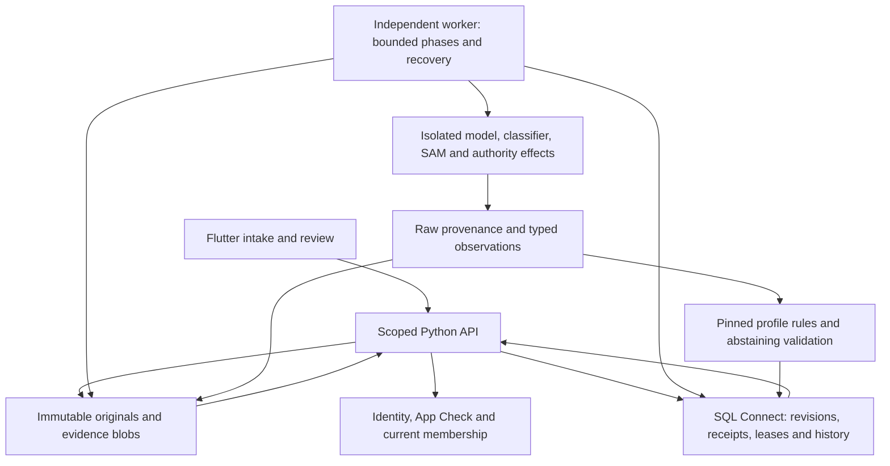

# Specimen product review handoff

This branch contains a connected local Insects pilot for review, with Flutter
web/Android/iOS clients, a scoped API, durable workflow state and immutable source
evidence. Synthetic execution is explicitly labeled. It does not establish museum
quality, approved production processing, physical-device behavior or deployment.

## Candidate and verification

Product source checkpoint: `ee4bec83715bf262deb9c7bff4598ad9211ddd44`.
Canonical verification at `f815fa6b647ce5040114b07da522c6c15a92469c` passed
351 Python tests with 26 gated skips, 68 Flutter tests with seven live skips,
analysis, repository/secret checks and release web build. An independent fresh
SQL database suite passed 71 tests; actual Flutter HTTP readback preserved exact
runtime policy revisions and captured telemetry. Skipped opt-ins are not passes.
See [integration evidence](WAVE2_INTEGRATION.md) for commands, logs and provenance.

Final independent runtime QA and latest-head remote CI are pending. Earlier
independent reviews cover intake/review, Unicode reading evidence, authority
decisions, atomic publication, large graphs and human language declarations in
their explicitly recorded local scope. See [QA](QA.md); earlier checkpoint
results must not be presented as verification of later changes.

Draft [PR #3](https://github.com/anurag-duddu/specimen-digitization-app/pull/3)
still contains first-repair head `a11724a` while this candidate awaits final QA.
Its five green CI jobs do not cover the later candidate. No merge is authorized.
Read-only verification on 2026-09-08 confirmed public Hosting and remote `main`
remain `82fd60eff90684d2c630a37c59e1250604ad1cae`; public marker/title smoke passed.

## Run the synthetic application

Use the pinned tools from [DEPLOYMENT.md](../DEPLOYMENT.md). These commands run
from the repository root and do not require Firebase credentials, model keys,
paid inference or cloud resources. Choose a fresh state directory for an isolated
demo; reuse it deliberately when checking restart/reconstruction.

Terminal 1:

```bash
uv sync --frozen
export SPECIMEN_SYNTHETIC_TOKEN="$(openssl rand -hex 24)"
uv run specimen-api --mode synthetic --state-dir /tmp/specimen-review-demo --port 8000
```

Keep the local bearer private. In terminal 2, set the same local token through
your terminal environment, then create and approve a generated synthetic label:

```bash
uv run specimen-demo --url http://127.0.0.1:8000
```

The command exercises real HTTP upload/chunks/completion, processing, review and
explicit synthetic-policy clearance. It prints the specimen ID and revision.
Model results are deterministic fixtures, not measured transcription quality.
Integration reran this CLI path successfully on 2026-09-08: specimen
`4e99dab8-9c35-56f0-8e29-fc12d38f1940`, cleared at revision 21. Retained local
evidence: `/var/folders/nq/t4rvrkyx2dx2293cx4bn8gfm0000gn/T/specimen-handoff-demo-3z_dvj29`.
The temporary server was stopped after verification.

Terminal 3:

```bash
cd apps/specimen_digitization
test -f lib/firebase_options.dart || cp lib/firebase_options.ci.dart lib/firebase_options.dart
flutter pub get --enforce-lockfile
flutter run -d web-server --web-port 3000 \
  --dart-define=SPECIMEN_API_BASE_URL=http://127.0.0.1:8000 \
  --dart-define=SPECIMEN_LOCAL_SYNTHETIC=true
```

Open http://localhost:3000. Use any test email and the local bearer as the password.
The client restricts this mode to a loopback API and shows a synthetic banner.
The CI Firebase placeholder is credential-free and ignored when copied. Remove
only a placeholder you created after the demo; preserve any pre-existing config.

Inspect the CLI-created specimen or upload
`apps/specimen_digitization/test/fixtures/synthetic-label.png` with the file picker.
Review source pixels, independent readings, supported fields and unresolved
values. Make a reasoned correction or abstention, inspect retained history, and
approve separately. Re-uploading identical bytes should identify the duplicate.
An unavailable composite risk remains **Unmeasured**; human approval does not
turn it into a measured score. The basic demo does not seed every specialized
runtime policy scenario; use the frozen fixtures and corresponding tests below.

Completion schedules local processing. After stopping/restarting the API, resume
pending work with the same state directory and an independent worker:

```bash
uv run specimen-worker --mode synthetic --state-dir /tmp/specimen-review-demo
```

Stop owned processes with Ctrl-C. This demonstration uses SQLite, which is only
the local synthetic adapter. SQL Connect remains the production database design.

## Run SQL and verification

For an isolated SQL-backed demo, start a fresh emulator in its own terminal:

```bash
SPECIMEN_TEST_PG_PORT=5589 SPECIMEN_TEST_DC_PORT=9539 scripts/data/serve-local.sh
```

Wait for its ready message. In the API terminal, use the same private local token:

```bash
SPECIMEN_SQL_EMULATOR_HOST=127.0.0.1:9539 uv run specimen-api \
  --mode synthetic --persistence sql-emulator \
  --state-dir /tmp/specimen-review-sql --port 8000
```

Use only one API on port 8000. The worker accepts the same persistence/state/host
options. The script creates a private PostgreSQL cluster and seeds demonstration
membership; Ctrl-C stops only that cluster. Fixed-fixture SQL tests need a fresh
database between complete suite runs to avoid intentional duplicate constraints.

```bash
scripts/ci/verify.sh
SPECIMEN_TEST_SQL_EMULATOR=true SPECIMEN_SQL_EMULATOR_HOST=127.0.0.1:9539 \
  uv run pytest tests/test_model_runtime.py tests/test_profile_runtime.py \
  tests/test_authority_runtime.py tests/test_sqlconnect_application.py \
  tests/test_http_process_restart.py -q
```

The broader SQL command and fixture-specific Flutter checks are recorded in the
integration/owner reports. Optional HEIC/RAW decoders, live HTTP, SQL and provider
tests have explicit enablement requirements. Native build commands are
`scripts/ci/build_mobile.sh android` and `scripts/ci/build_mobile.sh ios`, run
serially with Flutter checks. Debug Android and unsigned iOS compilation do not
prove signed distribution or device attestation.

## Architecture and data flow



Production uses Firebase Auth/App Check, SQL Connect and GCS; local mode substitutes
an explicit test bearer, SQLite or SQL emulator, local blobs and declared model
fixtures. The API authorizes each scope and revision; review writes use CAS and
idempotency receipts. The worker preserves intent before external effects and
retains unknown outcomes rather than blindly replaying them. Immutable originals,
raw observations, literal readings, human supersessions and authority decisions
remain distinguishable. Large graphs use bounded hash-verified artifact retrieval;
history remains read-only. Hosting currently delivers only static Flutter files.

## Documentation index

| Need | Authoritative starting point |
|---|---|
| Product requirements and all 20 P0 criteria | [PRD](../product-requirements/PRD.md), [acceptance matrix](ACCEPTANCE.md) |
| Architecture and wire contracts | [architecture](ARCHITECTURE.md), [contracts](CONTRACTS.md) |
| Integration provenance and verification | [wave 2 integration](WAVE2_INTEGRATION.md), [first integration](INTEGRATION.md) |
| Independent findings and closure scope | [QA](QA.md), [QA evidence directory](qa-evidence/) |
| Runtime policies, classifier and effect boundaries | [backend runtime](BACKEND_RUNTIME_POLICIES.md), [backend](BACKEND.md) |
| Flutter interactions and browser evidence | [current UI](UI_P0.md), [initial Flutter](FLUTTER.md) |
| Schema, auth, storage and recovery | [data](DATA.md), [runtime proposal](RUNTIME_PROPOSAL.md) |
| Release rules and native compilation | [deployment](../DEPLOYMENT.md) |
| Fixture secret-scan review | [scanner review](SECRET_SCAN_REVIEW.md) |
| Institutional and provider decisions | [runtime proposal](RUNTIME_PROPOSAL.md), [harness comparison](../product-requirements/HARNESS_OPTIONS.md) |

Owner reports are chronological evidence and may describe older checkpoints.
Use the integration ledger and exact SHAs to determine which claims apply.

## Decisions and gates before production

| Gate | Required evidence or decision |
|---|---|
| Final code review | Independent final runtime QA, resolved findings, exact-head canonical and all five CI jobs |
| Production merge | Explicit authorization; no merge has been authorized |
| Runtime delivery | Reviewed immutable container, supervised worker/engine choice, separate keyless delivery, readiness and restart tests |
| Data rollout | Reviewed schema/connector/rules migration, compatibility and rollback; current V3 uniqueness must account for legacy data |
| Backup and recovery | Approved retention/PITR/availability choices and successful restore drill; earlier metadata showed backups disabled and ZONAL SQL |
| Identity and access | Real Firebase/App Check registrations, ingress/CORS, least-privilege ADC/IAM allow-and-deny proof, approved client endpoint |
| Provider and SAM | Approved endpoints/model revisions/licenses, data sensitivity policy, server secret binding, budgets and actual model/mask provenance |
| Museum acceptance | Approved representative corpus, measured quality thresholds, mandatory-field/clearance semantics, qualified authority data and reviewer sign-off |
| Device/distribution | Android/iOS device behavior, production attestation, signing and distribution approval |
| Release proof | Merged-main CI, deploy job, public marker matching merge SHA and authenticated application smoke tied to runtime/schema revisions |

These gates require evidence; a static Hosting release cannot satisfy runtime or
data gates. No cloud resource, paid inference, schema/rule rollout or production
merge is authorized by this handoff.

## Cost proposal for review

The [runtime proposal](RUNTIME_PROPOSAL.md) names the proposed API region,
identities and trial sizing. No budget or workload has been approved. Before any
paid step, record daily specimen volume, average source bytes, labels per specimen,
model input/output tokens, SAM GPU seconds, retry rates, retained evidence and
backup growth, worker duty cycle, network transfer, logs and build minutes.

Calculate provider cost per specimen from each route's approved current input and
output token rates, plus SAM compute and bounded retry allowance. Add API/worker
compute, existing SQL, object/database/backup storage, cross-region transfer,
observability and attestation costs for a monthly estimate. Fetch dated regional
rates and billing-account discounts at approval time; this document quotes no
current dollar prices or free-tier assumptions.

Approve a maximum daily/monthly budget and a per-run model cap, then validate
enforced reservations and stop behavior before live work. Budget alerts and API
maximum instances alone are not hard spending caps. Missing policy, budget,
credentials, restore evidence or matching runtime/schema revisions keeps launch
blocked. Existing SQL costs continue independently of API scale-to-zero.
