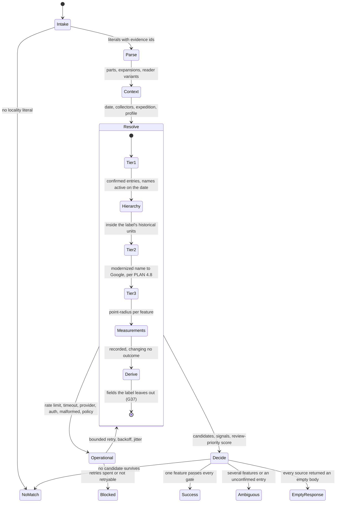

# Retrospective georeferencing: a plan for the harness's geography tool

**Status:** Proposed, not accepted by the owner (G12). The owner asked for the retrospective tool to be fully implemented (G34, 2026-09-24) and set its design the same day (G35 to G41; the owner's diagram is in 1.2), and S8 builds it. D4 and D5 are held, D8, D10 and D12 wait for their phase except for Getty TGN, wanted now (the coordinator's reading of G35), and D11 and D13 are the coordinator's engineering rulings. The Google Maps geography tool (G10) stays in production until two gates pass: the owner accepts this plan as G35 to G42 revise it (G12), and the acceptance lab shows this tool matches or beats the Google module (coordinator, 2026-09-24).

**Last verified:** 2026-09-24 (repository references and sources S32 and S33; the other sources on 2026-09-23)

**Scope:** How the harness's geography tool turns historical locality text into country, province or state, county and city values and a point-radius georeference, with typed outcomes and provenance: first for the Insects pilot, then for the Botany, Zoology, Geology and Anthropology profiles. The plan changes no queue logic (G5) and no code by itself.

**Author:** session S8 (research), for the owner's review

The plan rests on the ten pilot slides (four distinct localities, read by S8), eleven research reports whose sources are listed at the end, S4's draft interface for the geography tool, and a read-only probe, `scripts/research/georeferencing/pilot_probe.py`, which made 72 anonymous requests to Wikidata, the GeoNames dumps, GBIF and OpenTopoData on 2026-09-23; all 72 succeeded. Its GBIF steps now run only with `--held-steps`. Repository references are `file:line` on `origin/main` at 23ec26b, where each was checked on 2026-09-24. Owner decisions G1 to G18 are in `docs/execution/golive/PLAN.md` section 2.1; G19 to G26, taken on 2026-09-23, joined them with #87, and G27 to G31, taken the same day, with #104. G34 to G41, taken on 2026-09-24, are quoted from the owner's answers as the coordinator recorded them that day, and the coordinator's plan pull request #124 records them. Each choice the owner must confirm is marked **(Owner decision Dn)** and listed under [Owner decisions](#owner-decisions).

## 1. Executive summary and the core paradigm shift

Today the geography tool (`application/geography.py`) sends one literal to GBIF's GADM search and marks every candidate `unresolved` when a visit date is present (97-99), so every dated record ends in review, and the planner asks it only for `province_state` (`evidence_runtime.py` 556-559). G10 names Google Maps as the initial tool. The pilot shows why looking up a string cannot resolve 1946 labels:

1. **No gazetteer knows the Davao "Mt. McKinley".** The expedition's narrative says the names Mount McKinley and Mount Washington "appear on no maps that we have seen"; they came from a US Army intelligence report [S1]. Wikidata's search for "Mount McKinley" returns seven hits, none in the Philippines, Denali first [S2]. GeoNames, NGA GNS, Getty TGN and GEOLocate hold no Philippine peak of that name, and OpenStreetMap has none within 15 km of Mount Apo [S3][S4][S5][S6][S7].
2. **Jurisdictions changed.** "Davao Prov." in 1946 is the province of 1914-1967 (Wikidata Q15095071), divided in 1967 into Davao del Norte, Davao del Sur and Davao Oriental [S8][S2]. GeoNames and GNS carry "Davao Province" only as an alternate name of modern Davao del Norte (GeoNames 1715347), so a name match maps the whole 1946 province onto one of its five modern pieces [S3][S4].
3. **The museum's published georeferences disagree.** For "Mt McKinley, E slope" GBIF holds two points 23.58 km apart (Latlong.net; MaNIS); the probe read SRTM elevations of 1,318 m and 1,733 m there, neither within 150 m of the labels' 6,400 ft (1,951 m) or 3,300 ft (1,006 m). The point for "Mt Apo, east slope, Todaya" lies 0.64 km south-west of the summit, at 2,599 m in SRTM, with a stated uncertainty of 5.16 m; the Todaya camp was at 2,800 ft [S1][S9].
4. **The commercial path cannot hold the result.** Google's terms limit caching of Geocoding API coordinates to 30 days and bar content derived from Google Maps Content, so a Google coordinate cannot be the stored or GBIF-published georeference [S10]. The owner has since narrowed this further (G26, 2026-09-23): from Google geocoding the pipeline keeps only the place ID, its own outcome and a response fingerprint, and drops Google's names, address parts and coordinates everywhere, traces included. GEOLocate returned no uncertainty for any Philippine or Guatemalan query and ignored its `state` parameter there [S6].

The plan keeps one geography tool behind the harness's typed seam, S4's `geography_lookup`. Inside it a deterministic state machine runs the owner's three tiers (G35, 1.2): historical gazetteers with the museum's curator-confirmed entries (tier 1), a modern geocoder that receives the modernized name, in requests PLAN 4.8 governs (tier 2), and the point-radius uncertainty (tier 3). The tool returns one of the eleven `LookupStatus` outcomes per field key with its candidates, and the existing policy decides the queue (G5). Openly licensed sources supply the names, the modern units and the stored coordinates, credited (G35). From Google the pipeline keeps only the place ID, the outcome and the fingerprint (G26). Tier 3, every derivation and the georeference use open-source coordinates only, never Google's point (PLAN 4.8). When tier 1 finds nothing to modernize, Google receives the literal as today and G34 applies (the coordinator's reading of G35). The first table below contrasts the two approaches; the second gives the plan's expected outcomes for the pilot (details in 3.6).

| | Geocode a string (today, G10) | Reconstruct, then measure (proposed) |
|---|---|---|
| Question | Where is this text on a modern map? | What did the collector mean on the collection date, and how sure are we? |
| Input | one literal | every location literal with provenance, the parsed collection date, collectors, the profile |
| Output | a pin chosen from a modern index | a point-radius georeference with sources, or an abstention with ranked candidates |
| Uncertainty | none; Google's viewport is a display hint [S11] | computed per the Georeferencing Best Practices [S12][S13] |
| Failure mode | a confident wrong anchor, such as Denali for "Mount McKinley" | a typed `no_match`, `ambiguous` or operational outcome |
| Storage | Google coordinates cached 30 days at most [S10] | CC0 and CC BY coordinates with attribution; the verbatim text is immutable (PRD 12.4) |

| Locality (slides) | Georeference outcome | Reason |
|---|---|---|
| E. slope Mt. McKinley, 6,400 ft and 3,300 ft, Sept. 1946 (105526321-326) | `ambiguous` until a curator confirms an entry (G36); the slides go to needs human review because county and city wait for a settled location (G37) | no gazetteer match; an unconfirmed crosswalk hypothesis (Mount Talomo); the museum's points lie far from the labels' elevations |
| E. slope Mt. Apo, Nov. 1946 (105526327) | `ambiguous` from gazetteers; `success` once a curator confirms the itinerary (G36) | two "Mount Apo" features in 1946 Davao Province; the itinerary excludes one |
| Yepocapa, Chimaltenago, 4,800 ft, Apr. 1948 (105526328-330) | `success` | one town, at an elevation near the label's; "Chimaltenago" read as Chimaltenango, literal kept |

### 1.1 Fit with the repository and S4's interface

| Topic | Today on `main` | S4's draft `geography_lookup` (T3a, `application/harness_tools.py`, not merged) and this plan |
|---|---|---|
| Seam | `AuthorityTool.lookup(AuthorityQuery) -> AuthorityResult` (`evidence_harness.py` 343-346), specified as `LookupAdapter.execute(request, context) -> LookupResult` (`CONTRACTS.md` 268-274) | `GeographyQuery -> ToolResult`; the profile maps fields to tool ids (`CollectionProfile.field_tools`, S3) and sends country, province_state, county, city and precise_location to `geography_lookup`; an accepted plan replaces the implementation under that id and the harness does not change |
| Input | one literal, with the visit date as `historical_context` (`authority_registry.py` 37-43; `evidence_runtime.py` 584-586) | one call per record: `literals` (field key, the exact transcript substring, source observation and region) and `context` (four elevation literals, date literals with parsed partial dates, collectors, collection and profile ids) |
| Output | one `status` and `AuthorityCandidate` rows (`authority_registry.py` 111-138) | a call `outcome`, `field_outcomes`, `PlaceCandidate` and `GeoreferenceCandidate` lists, `checks` and `sub_calls` (section 5) |
| Planning, dates | `province_state` only (`evidence_runtime.py` 556-559); any date makes candidates `unresolved`, hence `ambiguous` (`geography.py` 97-99) | every geography field in one call; dates parsed by the harness only as written, and they clear at the precision written; a two-digit year reads as 19xx for Insects (owner decision G24, 2026-09-23); slide-preparation codes are never dates |
| Cost | `execute_one` refuses a non-zero cost reservation (`evidence_harness.py` 424-425) | open sources are free; Google is tier 2 (G35), so each of its calls reserves its cost (G30) |
| Coordinates | no georeference type (`domain.py` 196-204) | `GeoreferenceCandidate`; the G10 Google tool leaves it empty and keeps only the place ID, the outcome and the response's SHA-256 (G26); before T3a merges, `AuthorityCandidate.context_json` |
| Registry, retries | `AuthorityRegistry(version="unconfigured")` (`production.py` 628-633); `retry_after`, `retry_delay` (`reliability.py` 25-47); `Workflow.schedule_retry` (`workflow.py` 555-560, 641-650) | each source registered per scope and classification; short waits inside the tool, a longer `Retry-After` back to the workflow |

### 1.2 The owner's design (G35)

The owner answered D1 on 2026-09-24 with a design of their own, verbatim:

```text
[Legacy Text String]
       │
       ▼
[Tier 1: Historical Gazetteers] (GeoNames / Wikidata / Getty TGN)
       │
       ├─► Evaluates historical name + date active
       └─► Returns: Modern name equivalents & historical bounding polygons
       │
       ▼
[Tier 2: Modern Geocoders] (Google Maps API / Mapbox Geocoding)
       │
       ├─► Pipeline sends the *modernized* name + surrounding context
       └─► Returns: Highly accurate, precise modern coordinates
       │
       ▼
[Tier 3: Spatial Filtering] (Calculates final Point-Radius Uncertainty)

Google  should have current day location with coordinate. This will be helpful for future dataviz exercises
```

In the follow-up on storage the owner chose "Open sources + Google ID": "Store coordinates from openly licensed sources (Wikidata, GeoNames, NGA), credited. Keep Google's place ID, so a dataviz on a Google map can fetch Google's current coordinates live, which the terms allow."

This plan follows the owner's three tiers. Its tier 0, the museum's curated places and itineraries, now feeds tier 1; where the sections below still say tier 0, they mean those curated entries.

What any request carries, the diagram's "surrounding context" included, is governed by PLAN 4.8 (the coordinator's rulings): the elevations, dates and collectors in the tool's `context` (1.1) are used inside the tool and never sent.

| Owner's tier | In this plan | What the decisions of 2026-09-24 change |
|---|---|---|
| Tier 1, historical gazetteers (GeoNames, Wikidata, Getty TGN): the historical name and when it was in use, returning modern equivalents and historical extents | the curated entries (tier 0) and tier 1 (Wikidata, the GeoNames dumps, NGA GNS), with the anachronism filter (3.2) and the hierarchy gate | a curated entry settles a field only once a curator confirms it (G36); Getty TGN joins, as the owner's diagram names it (G35), and is wanted now (the coordinator's reading) |
| Tier 2, modern geocoders (Google Maps API / Mapbox Geocoding): "Pipeline sends the *modernized* name + surrounding context" | tier 2 | Google receives the modernized name, or the literal as today when tier 1 finds nothing to modernize, where G34 applies, in requests PLAN 4.8 governs; Mapbox is not used; only its place ID, outcome and fingerprint are kept (G26); its coordinates are never stored, traced or logged, and tier 3, derivations and the georeference never use them (the coordinator's readings of G35 and PLAN 4.8) |
| Tier 3, spatial filtering: the final point-radius uncertainty | tier 3 (3.8) | in-house (D13, the coordinator's ruling); while D4 and D5 are held, the museum-points check is off and sends nothing, and the other checks record findings that change no outcome |

The owner's decisions G36 to G38, G40 and G41 set how values are layered and filled in. The owner's words are quoted; the readings are the coordinator's (PLAN 2.1):
- **Layers (G38).** The owner: "Image - transcription - verbatim as per transcription(matching to field) - harness settled answers - derived from other fields. Essentially this is the hierarchy." Coordinator's reading: every field value records its layer, and a later layer never erases an earlier one.
- **Derived fields (G37, revising G22).** The owner: "these can be derived if other location related fields have returned a final value. If even those are unclear then it will wait for human review." Coordinator's reading: a field the label leaves out is derived from settled fields with its authority and evidence, and it fills the field, mandatory ones included; county and city are derived when the whole uncertainty circle lies inside one unit; a missing elevation is derived from the settled location with Copernicus GLO-30, the dataset the coordinator ruled on (D11), as the minimum and maximum over the uncertainty circle (PLAN 4.8).
- **Stated elevations (G41, revising G22).** The owner chose "Convert and fill": "The label's own number fills both From and To, and the metre fields are converted from it exactly (1 ft = 0.3048 m), each marked as derived with evidence." Coordinator's reading: a stated range keeps its own endpoints, and map data fills an elevation only where the label states none.
- **The harness's job (G36, G40).** The owner: "We cant make wrong conclusions" (G36) and "That's pretty much the job continuous lookups and discernment" (G40). Coordinator's reading: the harness reads everything transcribed and keeps looking things up until it settles or derives a field, or shows it can't, and it draws no conclusion without evidence.

S8 builds the geographic derivations (containment, Copernicus elevation, gazetteer naming) as derivation results behind S4's interface, which S4 consumes (coordinator, 2026-09-24). The coordinator's rulings in PLAN 4.8 (#124) apply to every source:
- A derived value names its settled inputs, its dataset or authority with the version, and the tool call.
- Every request the place tool sends, from any tier, carries only what PLAN 4.8 allows. S4's single place-request filter builds it, notation expansions included, and this plan does not restate that rule.
- A GeoNames username or a Getty credential, if one is ever needed, follows the Maps key's rules.

## 2. Technical analysis of the sources

| Source | Tier and role | Access and limits | License or terms | Pilot result (2026-09-23) | Verdict |
|---|---|---|---|---|---|
| Crosswalk and expedition itineraries (new, FMNH) | T0: historical names to modern candidates; dated camps with elevations | versioned reference data curated by people, never model output | FMNH, from published sources | "Mount McKinley (Davao, 1946)" to Mount Talomo, a hypothesis of moderate confidence; McKinley 6,400-ft camp 1-12 Sept., base camp at 3,300 ft 9 Aug.-6 Oct. 1946; Apo camps of November 1946 at 2,800-9,000 ft [S1] | build; a curator confirms each entry (G36) |
| GBIF occurrence search, FMNH records | T0: the museum's published georeferences for the same strings | anonymous; no published rate, HTTP 429 under load; `locality` and `recordedBy` match exact strings [S14] | per dataset: CC0, CC BY or CC BY-NC [S9] | McKinley: 2 clusters 23.58 km apart; Apo: 2 clusters 2.61 km apart; Yepocapa: 10 clusters up to 28.93 km apart | off while D4 is held: nothing is sent (coordinator); when D4 is taken up, its `catalogNumber` and `recordedBy` queries go to the owner as an explicit exception to PLAN 4.8 (PLAN 2.3) |
| Wikidata Action API (`wbsearchentities`) | T1 discovery | anonymous with a descriptive User-Agent [S15]; 0.2-0.4 s a call, never throttled in 20+ calls | CC0 [S15] | "Mount McKinley": 7 hits, none in the Philippines; "Chimaltenago": none, though CirrusSearch `Chimaltenago~1` finds Chimaltenango [S15] | use |
| Wikidata Query Service (SPARQL) | T1 enrichment of known items: start (P571, P580), end (P576, P582), successors (P1366), parents (P131), point (P625) | anonymous; 60 s deadline; HTTP 429 with `Retry-After` [S16], 120 s after S8's second request; a label search took 14-42 s | CC0 | Q15095071 valid in 1946; Mount Apo Natural Park (Q1504280) founded 2004-02-03 | enrichment only |
| GeoNames dumps and web service | T1 bulk gazetteer, loaded locally | dumps anonymous, updated daily; web service needs a username, 1,000 credits an hour, 10,000 a day [S3] | CC BY 4.0 [S3] | "Davao Province" only on modern Davao del Norte; 118 of 141,421 PH alternate names flagged historic; "Chimaltenago" fuzzy-matches Chimaltenango | pinned dumps read from the project's storage, so nothing is sent to GeoNames (PLAN 4.8); web service deferred (D12 waits) |
| NGA GNS (ArcGIS REST) | T1 cross-check; a type per name (N approved, V variant) | anonymous; 3,000 records a request [S4] | published for the public's information with a disclaimer; NGA's current pages state no license and request no citation [S33] | no McKinley peak; "Fort McKinley" as a variant only | cross-check |
| Getty TGN; World Historical Gazetteer | T1 hierarchy; corroboration | TGN SPARQL and reconciliation anonymous but degraded under scans, records now Linked Art JSON-LD, new gateway token-gated with no published way to get a token, all unchanged on 2026-09-24 [S32]; WHG needs a token [S5] | TGN ODC-By 1.0 [S5]; WHG mixed by source | TGN historic flags and dates empty; Mount Apo filed under Cotabato; no Yepocapa; WHG refused anonymous calls | TGN now (the coordinator's reading of G35); WHG deferred (D12 waits) |
| PSGC (PSA) | T1 modern Philippine units | `psa.gov.ph` refuses scripts; community mirror stale since 2022-08-27 [S17] | no explicit license found | not used | not used; sends nothing until a ruling adds it to PLAN 4.8 |
| GADM through GBIF's reverse geocoder; geoBoundaries | containment for derived county and city (G37); polygons for radials | anonymous; limits undocumented [S14] | GADM non-commercial, no redistribution without permission; geoBoundaries CC BY 4.0 [S18] | research only, from GBIF's GADM-based reverse geocoder: the Apo summit area sits on a three-province boundary (North Cotabato at distance 0, Davao del Sur about 90 m away) | GADM is not used, not even as a measurement (the coordinator's ruling, PLAN 4.8); containment uses geoBoundaries' open release, read from the project's storage and credited |
| Google Geocoding API | T2: the modernized name, in requests PLAN 4.8 governs (G35) | key; 10,000 free Essentials calls a month, then USD 5.00 per 1,000; only `country` and `postal_code` components restrict [S11] | coordinates cached 30 days at most, `place_id` indefinitely, no content derived from Maps Content [S10]; G26 keeps only place ID, outcome and fingerprint | not called: no key yet, and paid calls are refused | tier 2 (G35); place ID, outcome and fingerprint only (G26) |
| Mapbox Geocoding v6 | none | token; 1,000 requests a minute [S19] | no redistribution, even of paid permanent geocodes [S19] | not called | not used (the coordinator's reading of G35; the owner's diagram names Mapbox Geocoding) |
| Nominatim, Overpass (OpenStreetMap); Mapcarta | T2 check that a feature exists | Nominatim 1 request a second, no bulk; the public Overpass server warns of overload [S7] | ODbL: a stored coordinate table may be a derivative database [S7] | Apo tagged `natural=volcano`, not `peak`; no "McKinley" within 15 km; two Overpass timeouts | not used; sends nothing until a ruling adds it to PLAN 4.8; Mapcarta is built from OpenStreetMap, Wikidata and GeoNames [S7] |
| Point-radius method | T3 uncertainty, computed in-house | not applicable | open guides [S12][S13][S20] | no service returned an uncertainty outside the USA | build (D13, the coordinator's ruling) |
| GEOLocate | T3 candidate source, USA only | anonymous; no published limit; the community paces 3 s a request [S6] | no published web-service terms [S6] | `state` ignored outside the USA; uncertainty "Unavailable"; Apo tied with a Makati "Mount Apo" | not used; sends nothing until a ruling adds it to PLAN 4.8, and it serves no locality outside the USA |
| SRTM through OpenTopoData; Copernicus GLO-30 | T3 elevation: research; production | OpenTopoData 1 request a second, 1,000 a day, 100 points a request; Copernicus tiles on anonymous S3 [S21] | per dataset; Copernicus free with attribution to DLR and Airbus [S21] | every pilot point; SRTM LE90 is 16 m [S21] | research only; Copernicus for production (D11, the coordinator's ruling) and for derived elevations (G37) |
| iDigBio, Bionomia | T3 corroboration; collector itineraries | anonymous [S22] | per record | FMNH Philippines 1946-47: 8,674 records, against 8,752 on GBIF | not used; sends nothing until a ruling adds it to PLAN 4.8 (Bionomia is queried by collector) |
| Macrostrat, PBDB, Mindat; Pleiades, PeriodO, Local Contexts | T3 Geology (formation, fossils, minerals); T1 and T3 Anthropology (ancient places, periods, governance) | Mindat and Local Contexts need keys; the others are anonymous [S23][S24][S25] | Macrostrat CC BY 4.0, PBDB unverified [S23]; Mindat CC BY-NC-SA 4.0 with beta limits [S24]; Pleiades CC BY 3.0, PeriodO public domain [S25] | Apo point: Cenozoic volcanic rocks; Mindat refused anonymous calls | not used; sends nothing until a ruling adds it to PLAN 4.8; per profile (3.7), after D10 |

S4's Google rules in T3a and S8's refinements map Google's statuses onto the eleven outcomes [S11]. S8's refinements, marked (S8), set the georeference's own status only, which routes no record (G39); the place fields follow S4's rules (G34), so no review route is added (G5). Because `administrative_area` and `locality` only bias a query, a 1946 "Davao Province" request can return `OK` anchored on a centroid, so an approximate location never counts as a point georeference.

| Outcome | Google | Outcome | Google | Outcome | Google |
|---|---|---|---|---|---|
| success | one result, no `partial_match` (S4); for the georeference, also a type that fits the feature class (S8) | no_match | `ZERO_RESULTS` | rate_limited | `OVER_QUERY_LIMIT` |
| ambiguous | `partial_match` or several results (S4); for the georeference's own status only, a feature only at `APPROXIMATE` or `GEOMETRIC_CENTER` (S8) | empty_response | an empty or non-JSON 200 body | timeout | connection timeout |
| authentication_error | `REQUEST_DENIED` for a missing, bad or rejected key (S4) | authorization_error | `REQUEST_DENIED` for key restrictions; `OVER_DAILY_LIMIT` for billing | provider_error | `UNKNOWN_ERROR` |
| malformed_response | an unparseable body; S8 also files `INVALID_REQUEST` here as an adapter defect | policy_blocked | not a Google status: the registry | | |

Corrections to the charter:

1. P1365 is "replaces" and points to the predecessor; P1366 is "replaced by" and points to the successor. The charter has them reversed [S2].
2. GeoNames' historical codes exist (PCLH, ADMDH, ADM1H to ADM5H, PPLH) but are sparse: the 1914-1967 Davao Province has no historical record, although Maguindanao has one (ADM2H 1703701) [S3]. Getty TGN's historic flags and dates come back empty [S5].
3. GEOLocate cannot supply uncertainty outside the USA [S6], and Google's component filtering restricts only by country and postal code [S11]; the pipeline computes uncertainty itself (D13).
4. "ABCDG" is the Extension for Geosciences (EFG) built on ABCD 2.06, and neither is currently ratified (section 4) [S26][S27].

## 3. State machine and logic gates

### 3.1 States and gates



Any state that calls out can leave for the operational branch. Rate limits, timeouts and provider errors retry inside the tool while the wait is short; a longer `Retry-After` goes back to `Workflow.schedule_retry`. What remains is an operational block (QUE-005), never Deferred and never a review item.

| State | What it does | Hard gate | When the gate fails |
|---|---|---|---|
| Intake | receives every location literal with provenance, including locality text outside a field ("Mindanao") | at least one locality literal | `no_match`, reason `no_locality_literal` (105526324-328 if the right-hand label is not segmented) |
| Parse | a deterministic grammar and a versioned abbreviation table (Mt. to Mount, Prov. to Province, Mun. to Municipality, P.I. to Philippine Islands), which is the Insects profile's notation knowledge: every reading a notation allows is tried and the evidence settles one (G29); direction-only offsets ("E. slope of X"); elevations with units | a unit is never guessed | that elevation's check is `not_assessable` (on 105526322 both readers dropped the foot mark: "Elev. 6400") |
| Context | collection date from the harness's parsed dates (G24: parsed as written, two-digit years as 19xx for Insects); collectors; expedition | the tool infers no date of its own (HAR-019); preparation codes such as 10-6-78-1a or IX-17-66-2 are never dates | with no parsed date the anachronism filter runs as undated; an itinerary match counts only once a curator confirms the itinerary (G36) |
| Tier 1, curated | the crosswalk and itineraries S8 drafts with sources, feeding tier 1 (G35); the museum's published points are not queried while D4 is held | only curator-confirmed entries settle a field (G36) | an unconfirmed entry is a hypothesis: `ambiguous` at best |
| Tier 1, gazetteers | Wikidata search and enrichment, the GeoNames dump, GNS and Getty TGN (G35); a near match is one letter off, on full names only (G34, the coordinator's reading) | country, feature class, anachronism filter (3.2) | candidate dropped; a near match carries a `near_spelling` warning and the literal stays |
| Hierarchy | tests each candidate against the label's historical path, as the union of its successor units | inside the label's units | candidate dropped (Iloilo's "Apo Mountain") |
| Tier 2 | Google receives the modernized name (G35), or the literal when tier 1 finds nothing to modernize, where G34 applies (the coordinator's reading of G35), in requests PLAN 4.8 governs; modern units through successors and containment; the coordinate of record from openly licensed sources, credited | a storable source for a stored coordinate (G35) | Google's coordinates are never used for tier 3, a derivation or the georeference (PLAN 4.8); the georeference is `ambiguous`, reason `coordinate_not_storable` |
| Tier 3 | the point-radius: corrected center, geographic radial, direction-only sector, precision and datum (3.8), in-house (D13, the coordinator's ruling) | one feature: unrelated same-name features are not georeferenced [S13] | `ambiguous` |
| Measurements | checks typed `supports`, `conflicts` or `not_assessable`: containment, DEM elevation (the DEM is compared with the label's elevation in meters, as G41 converts it, 1 ft = 0.3048 m exactly; the verbatim stays as written), itinerary, profile checks (3.7); the occurrence check is off while D4 is held and sends nothing | none while D5 is held: each check records its measurement as a finding | never changes an outcome |
| Derive | fields the label leaves out, from settled fields (G37): county and city when the whole uncertainty circle lies inside one unit (the coordinator's reading), and a missing elevation as the GLO-30 minimum and maximum over the uncertainty circle (D11 and PLAN 4.8, coordinator rulings); a stated elevation's other unit and missing end come from S4's `apply_derivations` step (G41), not from this tool; each recorded as derived, with authority and evidence (G38) | the fields it derives from are settled | the field waits for needs human review (G37) |
| Decide | review-priority score (3.4); one outcome each for `country`, `province_state`, `county` and `city` into `field_outcomes`, each checked against its own literal; the georeference's outcome travels with `georeferences`; `precise_location` gets none, since no geocoder result settles or replaces it and where "E. slope Mt. McKinley" lies waits for a curator's confirmation (G36; S4's #113) | one feature passes every gate; the score orders review and sets no cut-off while D5 is held | `ambiguous` |

### 3.2 Anachronism filter

- An interpretation is valid when its start is on or before the collection date and its end on or after it, with the start from P571 or P580 and the end from P576 or P582 [S2]. Validity has three states, valid, not valid and undated; undated interpretations stay, flagged and weighted lower, because P131 statements often carry no dates. A partial date is an interval, and an interpretation must be valid across all of it.
- A place founded after the collection date leaves the historical interpretation. The probe excluded Mount Apo Natural Park (Q1504280, inception 2004-02-03) for the 1946 Apo label, and Davao del Norte, a 1967 successor, cannot be the 1946 "Davao Prov." although GeoNames and GNS carry that alternate name.
- Label lag: printed names outlive their jurisdictions. "P.I." on labels of September 1946 uses the colonial name two months after independence on 4 July 1946, when the Commonwealth (Q146328) ended [S2]. The tolerance for such a gap was part of D5, which is held: until the owner decides it, the gap is recorded as a `label_lag` finding and no tolerance widens a unit's active dates; "Philippine Islands" is also an English alias of the modern Philippines (Q928), so `country` resolves to Q928 either way.
- The modern jurisdiction is present-day by definition: it is reached through successors (P1366) and point containment and is never filtered by founding date.

### 3.3 Ambiguous names

- "Siberia": the first page of Wikidata results holds ten or more senses, among them the region, albums, an opera, an asteroid and a Mexican settlement [S15]. Only evidence on the record separates them: the country literal, the label's hierarchy, a feature class that fits the phrase, validity on the date and the expedition. If more than one unrelated sense survives, the outcome is `ambiguous` with ranked candidates, and the most prominent sense never wins by default [S13]. The same holds for same-name features inside one unit, such as the two "Mount Apo" in 1946 Davao Province, 92.7 km apart.
- "Mount McKinley": without the country gate the first hit is Denali, a silent wrong answer. Feature class is a gate too: inside the Philippines the "Philippine Islands" search also returns a 1941-42 military campaign (Q696462) and a Wikimedia list article (Q2389438).
- "Jones Farm": a private name missing from gazetteers is `no_match` for the feature. The owner answered with the order of layers (G38); in the coordinator's reading the county settles, the named spot stays verbatim, and the location is derived from the county at county precision and recorded as derived, its radius covering the county (S8). S8 had proposed that such a fallback go to review.
- Reader variants: where the readers disagree on a toponym (handwriting-qwen "Chimaltenango", handwriting-muse "Chimaltenago" on 105526329-330), both forms become query variants and the adjudicated literal stays the field literal. The label reads "Chimaltenago" on all three slides; Qwen silently corrected it. Under G20 a lookup that confirms exactly one reader's literal settles a disagreement, and a gazetteer confirms Qwen's corrected spelling exactly, so G20 would record a spelling the label does not have. The owner chose neither option offered and answered (G27, 2026-09-23, D14): "raw transcript anyway will have exactly as written, for verbatim field it will be as written but final location will be exact actual as settled by harness. we are always capturing both so there isn't an issue if people want to change later". As the plan records it (#104), the lookup settles the final value and the field clears; the verbatim is never replaced, neither by a lookup result nor by the spelling a lookup matched; when the first pass picked no reading and the readers' literals differ, each reader's reading is kept as captured and none is chosen; both are stored. The tool therefore returns the settled place (Chimaltenango, named from an openly licensed gazetteer) as the final value, with each reader's form and its provenance, and records the spelling difference as a `spelling_disagreement` finding, never a reason for review. When no reader's literal matches exactly (both readers faithful to "Chimaltenago", say), only a near match can settle the place. The owner decided this on 2026-09-24 (G34, D15): "clear with place ID byt I want the harness for location retrospective georeferencing fully implemented", choosing for the Google tool "The field clears with Google's place ID and no name; the label's spelling stays as the verbatim. Only when Google's name is one letter off and fits the other place fields, since a real test sends a Philippine label to Denali, Alaska." This tool applies the same gate, as the coordinator read G27 and G34 on 2026-09-24: a unique candidate one letter off the literal that fits the other place fields settles the place, comparing full names only, never codes or abbreviations, and the place is recorded under its openly licensed name and identifier, since G27 makes the final location the place the harness settles and G26 limits only Google; the label's spelling stays as the verbatim, and the field carries a `near_spelling` warning finding that never routes the record (G34, the coordinator's reading).

### 3.4 Confidence score

Hard gates come first; after them a transparent score ranks candidates for review. Like the repository's other measures (`bounded-levenshtein-fraction-v1`; `review_risk.py`, "explainable uncalibrated triage"), it is labeled review priority and is uncalibrated: while D5 is held it sets no cut-off and changes no outcome. Calibration uses curator-verified georeferences (section 6), and any threshold is the owner's decision (D5).

| Component | Values (proposed) | Weight (proposed) |
|---|---|---|
| Name match | exact 1.0; alias 0.9; historic alias or confirmed crosswalk 0.8; fuzzy at edit distance 1 0.6, at 2 0.4 | 0.25 |
| Temporal validity | valid 1.0; label lag 0.7; undated 0.6 | 0.15 |
| Hierarchy consistency | supports 1.0; not assessable 0.5 (a conflict is a hard gate) | 0.20 |
| Independent sources | two or more storable sources agreeing 1.0; one 0.5; copies of one source count once | 0.15 |
| Uncertainty radius | 1 minus the radius over the profile's maximum, not below 0 | 0.10 |
| Validation checks | the share of assessable checks that support | 0.15 |

### 3.5 Human-in-the-loop conditions

| Condition | Field outcome | Queue under the existing policy |
|---|---|---|
| no candidate in any tier | `no_match` | needs human review (QUE-003, G6) |
| every source returned an empty body | `empty_response` | needs human review |
| a place field with several unrelated features or only an unconfirmed curated entry (G36) | `ambiguous`, with reasons | needs human review (conflicting evidence; missing or ambiguous field) |
| the georeference with several unrelated features, only an unconfirmed curated entry (G36) or a coordinate only from a non-storable source | the georeference's own status: `ambiguous`, with reasons such as `coordinate_not_storable` | none of its own: the georeference lives in the result and the trace (G39) and routes no record (G5); fields the label leaves out that would be derived from it, such as county and city, wait for review (G37) |
| a named place not found, with its enclosing unit settled ("Jones Farm, Cook Co.") | the unit's field succeeds; the location is derived from the unit at its precision and recorded as derived (the coordinator's reading of G38) | cleared if every other gate passes; the named spot stays verbatim |
| a sensitive locality under the profile | `policy_blocked`, reason `sensitive_locality` | review or operational block per profile (PRD section 15); today's code treats every `policy_blocked` as operational |
| a rate limit, timeout or provider error after retries; missing or bad credentials, such as a revoked Google key; a malformed response | the matching operational outcome | operational block, never Deferred (QUE-005) |
| exactly one feature passes every gate | `success` | cleared only if every other gate passes (G1, QUE-002) |
| a field the label leaves out, with the fields it depends on settled | derived with authority and evidence (G37) | fills the field, mandatory fields included (the coordinator's reading of G37) |
| a field the label leaves out, with those fields unsettled | not derived | needs human review (G37) |

Under G1 a value the harness resolves is cleared, which is why `success` is earned through hard gates rather than a score. On PRD 12.4's question whether a Google-only match can support clearance, G10, G20, G27 and G34 let a Google lookup settle a place field, so it can; under G34 that includes a match one letter off the label's that fits the other place fields, kept as a place ID with no name. The owner's design (G35) sends Google the modernized name from tier 1, and in the coordinator's reading of G35 the literal when tier 1 finds nothing to modernize; S8's proposal to narrow Google-only clearance (D1) was not taken. Under G26 a Google `success` leaves only a place ID behind: a reviewer cannot see which place matched, and Google has no historical units, so for a label that predates a jurisdiction change (a 1946 "Davao Prov.") its match is a modern candidate, never evidence of the historical jurisdiction.

### 3.6 Worked examples: the four pilot localities

**Mt. McKinley** (105526321-326). Tier 1 finds no Philippine "Mount McKinley" in Wikidata or the GeoNames dump. "Davao Prov." resolves to Q15095071, valid in 1946, with three successors; "P.I." resolves to Q928 with `label_lag`. Tier 0 offers the crosswalk hypothesis Mount Talomo (Wikidata Q31472786, GeoNames 1683778; 7.0364, 125.3125; in Davao City by Wikidata's P131) and matches the itinerary: 3 and 6 September fall within the 6,400-ft camp (1-12 September) and 14 September within the 3,300-ft base camp (9 August to 6 October) [S1]; G24 reads the two-digit years on 105526321 and 324-326 as 1946, so the match holds on day, month and year. On an SRTM transect due east from Talomo's summit (2,620 m) the ground falls to 1,915 m at 1.5 km, near the 6,400-ft level (1,951 m), and crosses the 3,300-ft level (1,006 m) between 8 and 8.5 km; it climbs again to 1,795 m at 4.5 km, so a one-dimensional distance rule would misplace camps. The museum's two points, a research observation the tool does not query while D4 is held, lie far from both label elevations, 7.2 km north and 16.4 km south-south-east of Talomo. Outcome for the georeference: `ambiguous`, with three candidates and the transect shown to the reviewer, until a curator confirms an entry; the owner: "We cant make wrong conclusions" (G36). `province_state` succeeds on its historical interpretation (Q15095071, valid in 1946) and `country` on Q928; the modern unit (Davao City or a Davao del Sur municipality) waits for the point and travels as an open modern candidate. The labels name no county or city, and each gives one elevation. On 105526322 both readers dropped the foot mark ("Elev. 6400", 3.1), so that transcript states no unit, G41 converts nothing there without guessing one, and its elevation fields wait for review. On the other five slides the elevation in feet stays as written; G41 fills From and To with it and converts it to meters exactly, each marked derived, and GLO-30 does not apply, since the labels state an elevation (the coordinator's reading of G41; PLAN 4.8). County and city are derived once the location settles with its uncertainty circle inside one unit (the coordinator's reading of G37); until a curator confirms an entry the location does not settle, so county and city wait and these slides go to review.

**Mt. Apo** (105526327). Wikidata gives Mount Apo (Q455963; 6.9875, 125.2708; 2,954 m) and excludes Mount Apo Natural Park as founded in 2004. GeoNames gives 1730340 (SRTM 2,927 m), 6569865 near Malita (92.7 km away, SRTM 640 m, inside 1946 Davao Province [S1]) and 1730339 "Apo Mountain" in Iloilo, which the hierarchy gate drops. From gazetteers alone two unrelated features remain, so the outcome is `ambiguous` [S13]. The itinerary puts every camp of November 1946 on the main massif between 2,800 and 9,000 ft, and the four camps Hoogstraal calls east slope at 4,300-7,700 ft [S1]; a point at 640 m (about 2,100 ft) is below all of them. G24 reads the label's "'46" as 1946, so the match rests on collector, mountain, slope, month and year, and it counts once a curator has confirmed the itinerary (G36). Then one feature remains and the georeference is its east-slope sector (3.8): `success`, provided the sector's containment in the Davao successor units supports it (not yet computed); with no elevation on the label, that check is `not_assessable`. The museum's point for "east slope, Todaya" and "Baclayan" (0.64 km south-west of the summit, SRTM 2,599 m, stated uncertainty 5.16 m) falls outside the sector; the tool does not query it while D4 is held.

**Yepocapa** (105526328-330). Tier 1 gives the municipality item Q1523937 (point 14.5, -90.95; parent Chimaltenango), the settlement Q25173824, and GeoNames' town 3587636 (PPLA2; 14.50195, -90.95396) and municipality 3587635 (ADM2; 14.46725, -90.97416). "Chimaltenago" has no Wikidata hit; the GeoNames fuzzy match returns the department of Chimaltenango (ADM1 3598571) and a municipality of that name (ADM2 3598570), and the label's order and Yepocapa's parent select the department: a near spelling one letter off, with a `near_spelling` warning and the literal kept (G34, as the coordinator reads it for this tool). Against 4,800 ft, which G41 converts exactly to 1,463.04 m and fills as From and To, each marked derived, SRTM gives 1,427 m at Q1523937 (-36 m), 1,396 m at the town (-67 m) and 1,134 m at the municipality centroid (-329 m). While D5 is held these are measurements, and the georeference takes the town because it is the most specific place the label names. Q25173824 carries exactly GeoNames' coordinates, so S8 counts the two as one source; Q1523937 is a second point 0.48 km away. Five of the museum's ten published clusters carry only the town's name: three lie within 0.5 km of the GeoNames town point at elevations near the label's, and two lie 6.1 km and 22.9 km away at elevations far from it (research observations; the tool does not query them while D4 is held). G24 reads the two-digit years on 105526328-329 as 1948; no candidate carries a validity window, so the anachronism filter removes nothing. Outcome: `success`, with GeoNames 3587636 (CC BY 4.0) as the coordinate of record, the radius from the town's extent in Phase 1, `province_state` Chimaltenango, and the municipio and town of Yepocapa proposed as `county` and `city`, a mapping that stays open while D8 waits (4.2).

### 3.7 Checks per collection profile

Profiles choose the checks. A record's profile comes from the collection it was uploaded or imported into, resolved down the collection tree (G14; `COLLECTION_HIERARCHY.md` 73-76), which S3 is building.

| Profile | Checks | Notes |
|---|---|---|
| Zoology, Botany | containment, DEM elevation, itinerary; GBIF records of the same collector within 30 days and taxon plausibility are occurrence queries held under D4, so they send nothing, and when D4 is taken up its `catalogNumber` and `recordedBy` queries go to the owner as an explicit exception to PLAN 4.8 (PLAN 2.3); under D5 every check records findings only and changes no outcome | a stated uncertainty under 100 m on a historical text locality is a red flag, recorded as a finding |
| Geology | containment, stratigraphic plausibility (Macrostrat, PBDB), `GeologicalContext` terms | Macrostrat and PBDB send nothing until a ruling adds them to PLAN 4.8; Mindat only after D10 |
| Anthropology | a sensitivity gate before any external call: ARPA, NHPA section 304, the 2024 NAGPRA rule (43 CFR 10.9), CARE, Local Contexts [S28][S25] | withholds or generalizes coordinates and routes to review (D10) |

### 3.8 Point-radius geometry

The corrected center is the center of the smallest circle enclosing the feature, and the geographic radial runs from it to the farthest boundary point [S13]. A direction-only offset extends the feature within a cone set by the heading's precision until a constraining boundary [S13]; a cardinal heading such as "E" carries plus or minus 45 degrees [S12]. S8 reads "E. slope of X" as the part of X's circle (radial R) inside that cone, a quarter circle bounded by X itself. Its smallest enclosing circle has the chord between the arc ends as diameter: center 0.707 R from X's center along the heading, radius 0.707 R. This is S8's derivation from the QRG 2.2.2 geometry, to be checked against the Calculator [S20]. Coordinate precision, an unknown datum (worst case 5,359 m) and measurement error then combine by the Calculator's method, not by addition [S12] (D13). No pilot locality has a measured feature boundary yet, so this plan states no radius in meters for any of them.

## 4. Darwin Core and data integrity mapping

Darwin Core, term list version 2026-05-26, is the normative output [S29]. The charter's "ABCDG" is the ABCD Extension for Geosciences (EFG), built on ABCD 2.06, which was ratified on 2005-09-16 [S26]; a 2022 TDWG paper reports that both still needed (re-)ratification under the Standards Documentation Specification, and no later confirmation was found [S27]. ABCD 3.0 is not ratified [S26]. ABCD 2.06 with EFG is therefore a secondary export for Geology.

### 4.1 Field mapping

| App value | Darwin Core terms | Treatment |
|---|---|---|
| label transcript, all lines | `verbatimLabel` (MaterialEntity, added 2023-08-21) [S29] | verbatim |
| `precise_location` | `verbatimLocality`; `locality` | verbatim and never replaced; `locality` is the interpretation and may equal it |
| `country`; `province_state`, `county`, `city` | `country`, `countryCode`; `stateProvince`, `county`, `municipality` | modern names; ISO 3166-1 alpha-2 (D8) |
| historical path, successor chain | `higherGeography`; `locationRemarks` | historical units as interpreted, such as "Philippine Islands \| Mindanao \| Davao Province (1914-1967)" (D8) |
| the four elevation fields | `verbatimElevation`; `minimumElevationInMeters`, `maximumElevationInMeters` | `verbatimElevation` as written; G41 fills From and To from a single stated value and converts it to meters exactly (1 ft = 0.3048 m), each marked derived with evidence; a stated range keeps its own endpoints (the coordinator's reading of G41); only where the label states no elevation do the GLO-30 minimum and maximum over the uncertainty circle fill them (G37; D11 and PLAN 4.8, coordinator rulings) |
| `GeoreferenceCandidate` | `decimalLatitude`, `decimalLongitude`, `geodeticDatum` (EPSG:4326), `coordinateUncertaintyInMeters`, `coordinatePrecision`, `pointRadiusSpatialFit`; for a sector, `footprintWKT`, `footprintSRS`, `footprintSpatialFit` | interpreted |
| process metadata | `georeferencedBy` (pipeline name and version, D8), `georeferencedDate` (ISO 8601), `georeferenceProtocol` (the Best Practices and an in-house protocol), `georeferenceSources` (each source with version and access date), `georeferenceRemarks`, `georeferenceVerificationStatus` | a new georeference starts as "requires verification" [S12] |
| sensitivity | `informationWithheld`, `dataGeneralizations` | as in 4.5 [S30] |

### 4.2 Historical and modern jurisdictions

Darwin Core prescribes no convention for historical against modern jurisdictions [S29]. S8 proposes **(Owner decision D8)**: `verbatimLocality` as written; `higherGeography` the historical path as interpreted; `stateProvince`, `county` and `municipality` the modern units; `locationRemarks` the successor chain, such as "Davao Province (1914-1967), divided by RA 4867 into Davao del Norte, Davao del Sur and Davao Oriental" [S8]. Two conventions need a curator. Davao City has been chartered apart from the province since 1936 and stayed outside the 1967 provinces [S8], while GADM files it under Davao del Sur [S14]. A Guatemalan municipio is the second-level unit, so S8 maps it to `county` and the town to `municipality`. Modern units come from coordinates only when the whole uncertainty circle lies inside one unit (D7, decided as G37; the whole-circle rule is the coordinator's reading).

### 4.3 Example: Yepocapa, slide 105526329

The example follows the conventions S8 proposes in 4.2, which stay open while D8 waits.

| Term | Value |
|---|---|
| verbatimLocality; locality; higherGeography | Yepocapa, 4800 ft. / Chimaltenago, / Guatemala; Yepocapa; Guatemala \| Chimaltenango \| Yepocapa |
| country; countryCode; stateProvince | Guatemala; GT; Chimaltenango |
| county; municipality | Yepocapa (municipio, GeoNames 3587635); Yepocapa (town, GeoNames 3587636) |
| verbatimElevation; minimumElevationInMeters, maximumElevationInMeters | 4800 ft.; 1463.04 and 1463.04, each derived from the stated value by G41 |
| decimalLatitude; decimalLongitude; geodeticDatum; coordinatePrecision | 14.50195; -90.95396; EPSG:4326; 0.00001 |
| coordinateUncertaintyInMeters; pointRadiusSpatialFit | computed in Phase 1 from the town's extent; not stated here |
| georeferencedBy; georeferencedDate; georeferenceProtocol | specimen-digitization `geography_lookup` geo-tiered-0 (automated); 2026-09-23; Georeferencing Best Practices v1.2.1 and Quick Reference Guide, with an FMNH protocol still to be written |
| georeferenceSources | GeoNames GT dump (CC BY 4.0); Wikidata Q1523937 (CC0); Copernicus GLO-30 for the elevation check (D11); geoBoundaries' open release for containment (CC BY 4.0); each with its access date |
| georeferenceRemarks; georeferenceVerificationStatus | Town point, not the municipality centroid (GeoNames 3587635, 329 m below the label elevation); "Chimaltenago" read as Chimaltenango (edit distance 1); requires verification |
| locationRemarks | Elevation stated in feet only, converted to meters by G41 (1,463.04 m); the elevation check compares it with GLO-30 at the town. |

### 4.4 ABCD 2.06 and EFG

Verify each path against the ABCD 2.06 XSD before implementing [S26]; the nesting of `CoordinateMethod` and `AccuracyStatement` differed between fetches.

| Darwin Core | ABCD 2.06 path |
|---|---|
| locality, verbatimLocality | `Unit/Gathering/LocalityText` |
| country, countryCode; stateProvince, county | `Gathering/Country/Name`, `Gathering/Country/ISO3166Code`; `Gathering/NamedAreas/NamedArea/AreaName` with `AreaClass` |
| decimalLatitude, decimalLongitude | `Gathering/SiteCoordinateSets/SiteCoordinates/CoordinatesLatLong/LatitudeDecimal`, `LongitudeDecimal` |
| geodeticDatum; coordinateUncertaintyInMeters | `.../SpatialDatum`; `.../CoordinateErrorDistanceInMeters` |
| georeferenceProtocol; georeferenceSources | `.../CoordinateMethod`, `.../AccuracyStatement` (free text); no ABCD 2.06 equivalent found |
| minimum and maximum elevation | `Gathering/Altitude/MeasurementOrFactAtomised/LowerValue`, `UpperValue` |
| GeologicalContext (EFG) | `Unit/UnitStratigraphicDetermination/...`: `ChronostratigraphicAttributions`, `LithostratigraphicAttributions`, `BiostratigraphicAttributions` |

### 4.5 Sensitive localities

Chapman (2020) generalizes a copy for distribution, never the stored record, documents it in `dataGeneralizations` and `informationWithheld`, and sets grid categories from withholding or 1 degree down to 0.001 degree [S30]. That guide addresses sensitive species. For Anthropology the ceiling comes from law and governance: NAGPRA summaries give origin at county or State level only, ARPA and NHPA section 304 protect site locations, and CARE and Local Contexts give communities authority over their data [S28][S25]. Human remains, funerary or sacred objects and points on or near tribal land go to review before any coordinate is written (D10).

### 4.6 Integrity: licenses, storage and caching

Every evidence item carries a `storable` flag set from its license; only storable sources may feed the permanent georeference.

| Source | License or terms | Storable | Feeds the stored georeference |
|---|---|---|---|
| Wikidata | CC0 [S15] | yes | yes |
| GeoNames dumps; NGA GNS; Getty TGN | CC BY 4.0 [S3]; no license or citation request on NGA's current pages, so it is credited as NGA's GEOnet Names Server [S33]; ODC-By 1.0 [S5] | yes, attributed | yes, credited (G35); TGN now (the coordinator's reading of G35) |
| DEMs; Macrostrat | public domain or free with attribution [S21]; CC BY 4.0 [S23] | yes | as evidence only |
| GBIF occurrences (FMNH) | CC0, CC BY or CC BY-NC per dataset [S9] | as evidence | not queried while D4 is held |
| GADM | non-commercial, no redistribution [S18] | not used (the coordinator's ruling, PLAN 4.8) | no |
| geoBoundaries, open release | CC BY 4.0 [S18] | yes, credited | derived county and city (G37) |
| OpenStreetMap services | ODbL [S7] | not used until a ruling adds them to PLAN 4.8 | no |
| Google; Mapbox; GEOLocate; Mindat | coordinates 30 days, `place_id` indefinitely [S10]; no redistribution [S19]; no published terms [S6]; non-commercial with beta limits [S24] | no | no: Google's place ID only (G26, G35); Mapbox not used (the coordinator's reading of G35); Mindat waits with D10 |

Caching follows HAR-017 and `GBIF.md` 365-397: keyed by provider, operation, complete normalized request without any credential, source release (dump date or gazetteer version) and adapter version; success, empty, ambiguous and failure entries kept apart; retention set by profile and license; a Google entry holds only the place ID, the outcome and the fingerprint (G26), and no cache key carries a credential or a keyed URL (PLAN 4.5, 4.8); forced refresh supported. Each sub-call becomes one S5 ToolCall row (HAR-010, `PRD.md` 335; S5's `ToolCall`, `schema.gql` 263). On today's seam the results fit without a domain change in `AuthorityCandidate.context_json`, `FieldCandidate.normalizedValue` (typed `Any`, `schema.gql` 292-303) and `EvidenceItem.query` (`schema.gql` 241-251); the georeference lives in the tool result and the trace for the pilot, and record fields come after it (G39).

## 5. Python blueprint and orchestration

The code below is illustrative, not production code, and predates G35 to G41: its tier 0 is now the curated part of tier 1, its checks record measurements only while D4 and D5 are held, its score cut-off (`below_cutoff`) and label-lag tolerance wait with D5, and its containment step's GADM is not used (PLAN 4.8); the build follows `docs/execution/golive/GEO.md`, which #130 adds. The implementation registers under S4's `geography_lookup` id; inside it adapters run tier by tier, and the sub-adapters of one tier run concurrently while an HTTP gate admits each host through the repository's `provider_circuit.ProviderCircuit`, paces it, honors `Retry-After` through `retry_after` and `retry_delay` (`reliability.py` 25-47), maps each response to one of the eleven outcomes and records a sub-call for HAR-010 (query, source, retrieval time, response digest, raw reference, license; the tool version and matched identifiers travel on the result and its candidates). S4 owns `State`, `to_tool_result` and, until T3a merges, `to_authority_result` (built on `result_base`, so the lineage check at `evidence_harness.py` 451-456 holds). S8's additions to T3a, which S4 accepted on 2026-09-23, carry the plan's output:

| T3a element (S8's addition) | Why the plan needs it | Today's `AuthorityResult` |
|---|---|---|
| `LocalityLiteral.field_key` may be empty; the full verbatim locality also travels as one unassigned literal | locality text outside a field ("Mindanao", "Mun. Yepocapa") | one `literal` per query |
| `field_outcomes: dict[field_key, LookupStatus]`, which clearance reads | one outcome per field key | one `status` per call |
| `PlaceCandidate.role` (historical or modern), `valid_from`, `valid_to`, several per field key | HAR-014 separation and the anachronism filter | `relation` and `context_json` |
| `PlaceCandidate.source`; `GeoreferenceCandidate.sources` with license | provenance and the `storable` flag | `source_id`, `license` |
| `sub_calls`, one S5 ToolCall row each (`schema.gql` 263) | HAR-010 for every request (`PRD.md` 335) | one `raw_ref` and `response_sha256` |
| optional: ranked `georeferences`; `coordinate_precision`, `footprint_wkt`, `spatial_fit`, `remarks`, `verification_status`, `georeferenced_by`, `georeferenced_date`; `checks`; a taxon literal | the Darwin Core metadata of 4.1 and the checks of 3.1 | `context_json` |

The Wikidata payload below enriches the items that `wbsearchentities` found and ran live on 2026-09-23. A full-graph label and alias search took S8 14-42 s against the service's 60 s deadline [S16], so discovery goes through the Action API.

```sparql
SELECT ?item (SAMPLE(STR(?label)) AS ?name) (SAMPLE(?coord) AS ?point) (MIN(?from) AS ?validFrom)
       (MAX(?to) AS ?validTo) (GROUP_CONCAT(DISTINCT ?iso; separator=" ") AS ?countries)
       (GROUP_CONCAT(DISTINCT STR(?classLabel); separator="; ") AS ?classes)
       (GROUP_CONCAT(DISTINCT STR(?nextLabel); separator="; ") AS ?replacedBy)
       (GROUP_CONCAT(DISTINCT STR(?parentLabel); separator="; ") AS ?parents)
WHERE {
  VALUES ?item { %s }
  OPTIONAL { ?item rdfs:label ?label FILTER(LANG(?label) IN ("en", "mul")) }
  OPTIONAL { ?item wdt:P625 ?coord }
  OPTIONAL { ?item wdt:P571|wdt:P580 ?from }
  OPTIONAL { ?item wdt:P576|wdt:P582 ?to }
  OPTIONAL { ?item wdt:P17/wdt:P297 ?iso }
  OPTIONAL { ?item wdt:P31 ?class . ?class rdfs:label ?classLabel FILTER(LANG(?classLabel) = "en") }
  OPTIONAL { ?item wdt:P1366 ?next . ?next rdfs:label ?nextLabel FILTER(LANG(?nextLabel) IN ("en", "mul")) }
  OPTIONAL { ?item wdt:P131 ?parent . ?parent rdfs:label ?parentLabel FILTER(LANG(?parentLabel) IN ("en", "mul")) }
}
GROUP BY ?item
```

```python
"""Illustrative blueprint, not production code (S8, 2026-09-23). "S4:" marks a harness choice."""
import asyncio, hashlib, json, math, time
from datetime import date, datetime, timezone
from pathlib import Path
from typing import Literal, Protocol
import httpx
from pydantic import BaseModel
from specimen_digitization.application.domain import OPERATIONAL, LookupStatus
from specimen_digitization.application.reliability import retry_after, retry_delay

ENRICH = (Path(__file__).parent / "enrich.rq").read_text()  # the tested payload above
Signal = Literal["supports", "conflicts", "not_assessable"]
RETRYABLE = {LookupStatus.RATE_LIMITED, LookupStatus.TIMEOUT, LookupStatus.PROVIDER}
HTTP = {401: LookupStatus.AUTHENTICATION, 403: LookupStatus.AUTHORIZATION, 429: LookupStatus.RATE_LIMITED}

class SubCall(BaseModel):  # one ToolResult.sub_calls entry (HAR-010), recorded by the gate per request
    source: str
    query: dict
    outcome: LookupStatus
    retrieved_at: str
    response_sha256: str | None
    license: str  # decides whether a value may be stored (section 4.6)
    raw_ref: str | None = None  # blob written by S4's storage
class Candidate(BaseModel):  # becomes a PlaceCandidate, or feeds a GeoreferenceCandidate (HAR-004, HAR-014)
    source_id: str  # "wikidata:Q1523937", "geonames:3587636"
    feature_id: str  # candidates for the same place share this id
    role: Literal["historical", "modern"]  # T3a PlaceCandidate.role
    point: tuple[float, float] | None = None
    name_match: str = "exact"  # exact, alias, historic_alias, crosswalk, fuzzy1, fuzzy2
    validity: Literal["valid", "label_lag", "undated", "not valid"] = "undated"
    signals: dict[str, Signal] = {}  # ToolResult.checks: hierarchy, elevation, itinerary, occurrence
    storable: bool = False
    hypothesis: bool = False  # tier-0 entry that no curator has confirmed yet
    museum_published: bool = False  # FMNH's own published point: not queried while D4 is held
class SourceResult(BaseModel):  # one sub-adapter run
    status: LookupStatus
    candidates: list[Candidate] = []
    calls: list[SubCall] = []
    retry_after_seconds: int | None = None
class FieldOutcome(SourceResult):  # ToolResult.field_outcomes[field_key] with its candidates
    field_key: str  # country, province_state, county, city; "georeference" for the point-radius
    reasons: list[str] = []
class SourceAdapter(Protocol):  # typed outcomes only; a sub-adapter never raises
    async def run(self, state: "State", gate: "HttpGate") -> SourceResult: ...

class HttpGate:
    """Per-host circuit and pacing, Retry-After, bounded retries with jitter, typed outcomes, provenance."""
    def __init__(self, client: httpx.AsyncClient, circuit, keys: dict, pace_s: dict[str, float], attempts=3,
                 longest_wait_s=20.0):  # circuit: provider_circuit.ProviderCircuit; keys: a CircuitKey per host
        self.client, self.circuit, self.keys, self.pace = client, circuit, keys, pace_s
        self.attempts, self.longest, self.slots, self.locks = attempts, longest_wait_s, {}, {}

    async def get(self, source: str, license: str, url: str, params: dict) -> tuple[SubCall, bytes, int | None]:
        host, status, body, wait = httpx.URL(url).host, LookupStatus.PROVIDER, b"", None
        admission = self.circuit.admit(self.keys[host], probelease_seconds=60)
        if admission.status == "permitted":  # an open circuit stays provider_error for the workflow
            async with self.locks.setdefault(host, asyncio.Lock()):
                for attempt in range(1, self.attempts + 1):
                    await asyncio.sleep(max(0.0, self.slots.get(host, 0.0) - time.monotonic()))
                    self.slots[host] = time.monotonic() + self.pace.get(host, 1.1)
                    try:
                        response = await self.client.get(url, params=params)
                        status, body = classify(response), response.content
                        hint = retry_after(response.headers.get("Retry-After"))
                    except httpx.TimeoutException:
                        status, body, hint = LookupStatus.TIMEOUT, b"", None
                    wait = retry_delay(attempt, hint)  # jitter, never earlier than Retry-After
                    if status not in RETRYABLE or attempt == self.attempts or wait > self.longest:
                        break  # a longer wait goes back to the workflow's schedule_retry
                    await asyncio.sleep(wait)
            if status in OPERATIONAL:
                self.circuit.record_failure(admission.token, status.value, hint)
            else:
                self.circuit.record_success(admission.token)
        # anonymous sources only: no credential enters url or params, so none lands in a record; Google
        # goes through S4's Google tool, which never records its keyed request URL (PLAN 4.5)
        call = SubCall(source=source, query={"url": url, **params}, outcome=status, license=license,
                       retrieved_at=datetime.now(timezone.utc).isoformat(),
                       response_sha256=hashlib.sha256(body).hexdigest() if body else None)
        return call, body, math.ceil(wait) if wait and status in RETRYABLE else None

def classify(response: httpx.Response) -> LookupStatus:
    code, kind = response.status_code, response.headers.get("content-type", "")
    if code in HTTP or code >= 500:
        return HTTP.get(code, LookupStatus.PROVIDER)
    if code >= 400 or (response.content and "json" not in kind):
        return LookupStatus.MALFORMED  # adapter defect (PRD 15), or HTML from a degraded server
    return LookupStatus.SUCCESS if response.content else LookupStatus.EMPTY

def valid_on(valid_from: str | None, valid_to: str | None, day: date) -> str:  # section 3.2
    if not valid_from and not valid_to:
        return "undated"
    if valid_from and date.fromisoformat(valid_from[:10]) > day:
        return "not valid"  # founded after the collection date
    if valid_to and date.fromisoformat(valid_to[:10]) < day:
        return "label_lag"  # a finding with its gap; no tolerance widens the dates while D5 is held
    return "valid"

class WikidataTier1:  # discovery through the Action API, then one SPARQL enrichment by QID
    api, sparql = "https://www.wikidata.org/w/api.php", "https://query.wikidata.org/sparql"

    async def run(self, state: "State", gate: HttpGate) -> SourceResult:
        search = {"action": "wbsearchentities", "search": state.name, "language": "en", "type": "item",
                  "limit": 7, "format": "json"}  # S4: CirrusSearch "name~1" when this finds nothing
        call, body, wait = await gate.get("wikidata", "CC0-1.0", self.api, search)
        calls, ok = [call], call.outcome == LookupStatus.SUCCESS
        ids = [hit["id"] for hit in json.loads(body).get("search", [])] if ok else []
        if ids:
            query = {"query": ENRICH % " ".join(f"wd:{i}" for i in ids), "format": "json"}
            call, body, wait = await gate.get("wikidata", "CC0-1.0", self.sparql, query)
            calls.append(call)
        if call.outcome != LookupStatus.SUCCESS:
            return SourceResult(status=call.outcome, calls=calls, retry_after_seconds=wait)
        candidates = []
        for row in json.loads(body).get("results", {}).get("bindings", []) if ids else []:
            value = {key: cell["value"] for key, cell in row.items()}
            if state.iso not in value.get("countries", "").split() or not state.accepts(value.get("classes", "")):
                continue  # hard gates: Denali for "Mount McKinley"; a 1941 campaign for "Philippine Islands"
            lon, lat = map(float, value["point"][6:-1].split()) if "point" in value else (None, None)
            qid = value["item"].rsplit("/", 1)[1]
            candidates.append(Candidate(
                source_id=f"wikidata:{qid}", feature_id=qid, role="historical", storable=True,
                point=None if lat is None else (lat, lon),
                validity=valid_on(value.get("validFrom"), value.get("validTo"), state.day)))
        status = LookupStatus.SUCCESS if candidates else LookupStatus.NO_MATCH
        return SourceResult(status=status, candidates=candidates, calls=calls)

def sector_circle(radial_m: float, half_width_deg: float = 45.0) -> tuple[float, float]:
    """Center offset along the heading and radius of the smallest circle around the part of a
    feature within +/- half_width of a heading ("E. slope of X"; a cardinal heading is +/-45
    degrees, BP Table 4). S8's derivation from QRG 2.2.2; check it against the Calculator."""
    half = math.radians(half_width_deg)
    if half_width_deg >= 45:  # the chord between the arc ends is a diameter
        return radial_m * math.cos(half), radial_m * math.sin(half)  # 45 degrees: 0.707 R, 0.707 R
    return radial_m / (2 * math.cos(half)), radial_m / (2 * math.cos(half))  # apex on the circle

def decide(field_key: str, results: list[SourceResult], radius_m: float | None, policy) -> FieldOutcome:
    """One outcome per field key: operational first, then hard gates, then the score."""
    if blocked := [r for r in results if r.status in OPERATIONAL]:  # QUE-005: never Deferred
        return FieldOutcome(field_key=field_key, status=blocked[0].status, reasons=["operational"],
                            retry_after_seconds=blocked[0].retry_after_seconds)
    shown = [c for r in results for c in r.candidates]
    pool = [c for c in shown if not c.museum_published and c.validity != "not valid"
            and c.signals.get("hierarchy") != "conflicts"]
    if not pool:  # no data found: needs human review under the existing policy (G6, QUE-003)
        empty = bool(results) and all(r.status == LookupStatus.EMPTY for r in results)
        return FieldOutcome(field_key=field_key, candidates=shown,
                            status=LookupStatus.EMPTY if empty else LookupStatus.NO_MATCH)
    sources = {f: len({c.source_id.split(":")[0] for c in pool if c.feature_id == f and c.storable})
               for f in {c.feature_id for c in pool}}  # copies of one source count once
    score = lambda c: policy.review_priority(c, sources[c.feature_id], radius_m)  # section 3.4, uncalibrated
    ranked = sorted(pool, key=score, reverse=True)
    point, top = field_key == "georeference", ranked[0]
    reasons = [name for name, failed in (
        ("several_features", len(sources) > 1),  # QRG 2.4.3.2: do not georeference
        ("unconfirmed_hypothesis", any(c.hypothesis for c in pool)),
        ("signal_conflicts", any("conflicts" in c.signals.values() for c in pool)),
        ("coordinate_not_storable", point and not top.storable),
        ("radius_missing_or_too_large", point and (radius_m is None or radius_m > policy.max_radius_m)),
        ("below_cutoff", score(top) < policy.cutoff),  # the score can demote, never promote
    ) if failed]
    return FieldOutcome(field_key=field_key, candidates=ranked + [c for c in shown if c not in pool],
                        status=LookupStatus.AMBIGUOUS if reasons else LookupStatus.SUCCESS, reasons=reasons)

class GeoreferenceTool:  # S4's geography_lookup (T3a draft): GeographyQuery -> ToolResult
    tool, version = "geography_lookup", "geo-tiered-0"
    def __init__(self, tiers: list[list[SourceAdapter]], gate: HttpGate, policy):
        self.tiers, self.gate, self.policy = tiers, gate, policy

    def lookup(self, query):  # sync wrapper; an async agent awaits outcomes() instead
        state = State.from_query(query)  # GeographyQuery: literals with provenance, dates, collectors
        return to_tool_result(query, asyncio.run(self.outcomes(state)))  # or to_authority_result today

    async def outcomes(self, state: "State") -> dict[str, FieldOutcome]:
        for tier in self.tiers:  # tier 0, tier 1, hierarchy, tier 2, uncertainty, validation
            results = await asyncio.gather(*(adapter.run(state, self.gate) for adapter in tier))
            state.add(results)  # sub-adapters of one tier run concurrently; hosts stay paced
            if any(r.status in OPERATIONAL for r in results):
                break  # the gate has already spent the bounded retries
        # ToolResult.field_outcomes holds the four units; precise_location gets no outcome (S4's #113),
        # and the "georeference" entry becomes ToolResult.georeferences, not a field outcome.
        return {key: decide(key, state.results_for(key), state.radius_for(key), self.policy)
                for key in ("country", "province_state", "county", "city", "georeference")}
```

Replayed against the probe's recorded responses, the code returns `no_match` for "Mount McKinley" in the Philippines, Q15095071 `valid` for "Davao Province" in 1946, Q1504280 `not valid`, and Q928 as the only "Philippine Islands" candidate after the class gate; it hands a 120 s `Retry-After` back to the workflow instead of sleeping, and an open circuit becomes `provider_error`.

## 6. Next steps for Phase 1 prototyping

| # | Step | Owner | Exit criterion |
|---|---|---|---|
| 1 | Owner decisions: D1 to D3, D6, D7 and D9 (G35 to G39) and D14 and D15 (G27, G34) are decided; D4 and D5 are held; D11 and D13 are the coordinator's rulings; D8, D10 and D12 wait, except Getty TGN, wanted now (the coordinator's reading of G35) | owner | recorded here, 2026-09-24 |
| 2 | Confirm or reject the McKinley crosswalk entry and the 1946-47 expedition itinerary from S8's review sheets, routed through the owner. On 2026-09-24 the owner decided not to send the sheets for now: "That’s fine. Human review is ok" (the owner's message, relayed by the coordinator). The entries stay unconfirmed, and the six McKinley slides and the Apo slide go to needs human review until a curator confirms an entry | the Insects collection manager or a curator they name (G36) | a confirmed entry lands in a pull request that cites the owner's recorded confirmation, with a test that an unconfirmed entry never settles; the repository records the confirming role and date, never a name (G36; the coordinator's ruling in PLAN 4.8) |
| 3 | Merge T3a with S8's accepted additions; map the pilot's geography fields to `geography_lookup` | S4, S3 | contract tests pass |
| 4 | Build tier 1 (curated entries, itineraries, Wikidata, the GeoNames dumps, GNS, Getty TGN) with fakes and the probe's recorded responses as fixtures (HAR-018) | S8 (G34, G35) | the fixtures reproduce the probe's results for the four localities |
| 5 | Build tier 2 (Google with the modernized name, through S4's Google tool), tier 3 (the point-radius module: corrected center, radial, sector, the Calculator's combination) and the derivations (containment, Copernicus elevation, gazetteer naming; G37) | S8 (G34, G35, D13) | matches the Calculator's worked examples; a typed outcome for every row of 3.5 |
| 6 | Evaluate on the four pilot localities and a calibration set of FMNH records with curator-verified georeferences | S8 with a curator | precision and coverage per outcome; measurements for the owner, should D4 or D5 be taken up |
| 7 | Replace the G10 Google tool behind the same `geography_lookup` interface once the owner accepts this plan as G35 to G42 revise it (G12) and the acceptance lab shows this tool matches or beats the Google module; until then the Google tool stays in production (G12 and the coordinator's lab gate) | S8, S3, S7, owner | the pilot's geography fields call this tool, with Google as its tier 2 (G35; coordinator, 2026-09-24) |

Cost: the open sources cost USD 0, inside G9's USD 25. Google Geocoding is free for the first 10,000 Essentials calls a month and USD 5.00 per 1,000 after that [S11]; as tier 2 (G35), each call reserves its cost (G30).

Risks: Wikidata throttling (HTTP 429 with `Retry-After` after S8's second request from a shared address [S16]) is met by discovery through the Action API, a local cache and retries through the workflow; Getty's move to a token-gated gateway [S5] by its reconciliation service and SPARQL endpoint, which still answer anonymously, so no access is needed (PLAN 2.3; S32); license obligations for GeoNames, NGA, Getty and the DEMs by attribution in `georeferenceSources` and dataset metadata (D2); sparse historical names by a tier-0 crosswalk curated by people; and the museum's repetition of one retrospective point across hundreds of records by not querying those points while D4 is held.

Other workstreams: S8 builds the tool in its own modules behind S4's T3a interface (G34), with Google as tier 2 through S4's Google tool (G35), and the geographic derivations (containment, Copernicus elevation, gazetteer naming) as derivation results that S4 consumes (coordinator, 2026-09-24); S4 keeps the interface and the Google tool. S5 stores one ToolCall row per sub-call (HAR-010; `schema.gql` 263); record fields for the georeference come after the pilot (G39). S3 maps the geography fields to `geography_lookup` in `field_tools`, selects checks per collection and implements profile inheritance (`COLLECTION_HIERARCHY.md` 73-76).

## Owner decisions

The owner decided D1 to D3, D6, D7 and D9 on 2026-09-24 (G35 to G39, quoted below with the coordinator's readings), settled stated elevations the same day (G41, revising G22) and dismissed D4 and D5, which are held: until decided, D4's occurrence check is off and sends nothing, and D5's checks record their measurements as findings and never change an outcome. D11 and D13 are engineering choices the coordinator ruled on the same day. D8, D10 and D12 wait for their phase, except Getty TGN, wanted now (the coordinator's reading of G35), and nothing is built for them. The options and S8's recommendations below are as the owner was asked. D14 and D15 are decided: D14 on 2026-09-23 (G27), ahead of the rest because S4 was building G20, and D15 on 2026-09-24 (G34), when the owner also asked for this tool to be fully implemented.

| # | Question | Options | S8 recommendation | What it blocks |
|---|---|---|---|---|
| D1 | What role does Google play inside this tool? (G10, G26, G34; PRD 12.4) | a) Google keeps its role under G34: a Google-only match clears the field with the place ID alone, including a match one letter off that fits the other place fields, and open sources add names, historical and modern units and the point-radius. b) Google confirms only that a place exists: open sources settle the place fields, and a Google-only match no longer clears a field on its own when the label predates a jurisdiction change, such as a 1946 "Davao Prov.". c) Drop Google and use open sources only. d) Negotiate enterprise terms so that Google's names and coordinates may be kept. | b. **It conflicts with G34**, which the owner decided on 2026-09-24: under G34 a Google match one letter off that fits the other place fields clears the field with its place ID, and under b such a match would no longer clear a field on its own when the label predates a jurisdiction change, because Google knows only today's units and G26 leaves a reviewer no name to check. a keeps G34 as it stands, b narrows it for such labels, c retires it with Google, and d would reopen G26. **Decided by the owner (G35, 2026-09-24)** with a design of their own, the three tiers in 1.2, whose tier 2 is "Modern Geocoders" ("Google Maps API / Mapbox Geocoding"), to which the "Pipeline sends the *modernized* name + surrounding context". In the coordinator's reading of G35, Google is tier 2 and Mapbox is not used, and a request carries the modernized name with the same reading's place fields, as PLAN 4.8 governs | the tier-2 Google step and how a Google-only match counts; the paid-call path; the PRD 12.4 source table |
| D2 | Where do stored coordinates come from, and how are their sources credited? | a) Openly licensed gazetteers supply the coordinate of record: Wikidata (CC0), the GeoNames dumps (CC BY 4.0) and NGA GNS (citation requested), each credited in `georeferenceSources` and the dataset metadata. b) The tool proposes coordinates, and only a coordinate a curator enters is stored. c) No coordinates in Phase 1: place names and units only. | a. **Decided by the owner (G35, follow-up):** "Open sources + Google ID" | storing any coordinate or radius in `georeferences`; any export |
| D3a | Who confirms the places only the museum's own sources know, and what does an unconfirmed entry do? No gazetteer holds the "Mt. McKinley" of six pilot slides, and S8's evidence points to Mount Talomo (3.6) | a) The Insects collection manager, or a curator they name, confirms each entry S8 drafts with its sources; an unconfirmed entry never settles a field. b) Entries are shown to reviewers as candidates and never settle a field, confirmed or not. c) No curated entries: a name no gazetteer holds stays unresolved. | a. **Decided by the owner (G36):** "Curator confirms"; the repository records the confirming role and date, never a name (the coordinator's ruling, PLAN 4.8) | tier 0 (the crosswalk and itinerary files); the georeference of the six McKinley slides |
| D3b | May an expedition itinerary a curator has confirmed count as evidence that settles a place, when the collector, the place and the date all match it? | a) Yes. b) No: it is shown to reviewers only. | a. **Decided by the owner (G36):** a confirmed itinerary match settles a field, as on the Apo slide | the georeference of the Apo slide (105526327); the itinerary check |
| D4 | How do the museum's own published georeferences (FMNH points on GBIF) count? | a) As support: agreeing with one helps settle a place. b) As candidates shown to reviewers; a disagreement is a warning finding and never blocks clearance. c) Not at all. | b: one retrospective point is often repeated on hundreds of records, so agreeing with it proves little. **Held:** the owner dismissed it on 2026-09-24; the check is off and sends nothing (coordinator), and when D4 is taken up, its `catalogNumber` and `recordedBy` queries go to the owner as an explicit exception to PLAN 4.8 (PLAN 2.3) | the occurrence check |
| D5 | Which numeric limits do the checks use? | a) S8's provisional values now: an elevation within 150 m of the label's (four Yepocapa figures spread 60 m); a second source agrees when it lies within the candidate's own radius; a unit's name still counts for 10 years after the unit ended, since labels keep old names ("P.I." in September 1946); the maximum radius per profile and the score cut-off follow the pilot's runs (section 6, step 6). b) The Insects collection manager sets the values before the pilot runs. c) No numeric limits in Phase 1: the checks are recorded as findings and never change an outcome. | a. **Held:** the owner dismissed it on 2026-09-24; the checks record measurements and change no outcome | how the checks change an outcome in `decide`; the checks record their measurements under every option |
| D6 | When a named spot cannot be found, may the enclosing unit settle the georeference? (the G24 and G25 principle, applied to places) | a) No: a georeference settles only at the precision the label states; for "Jones Farm, Cook Co." with no Jones Farm found, the county is shown to reviewers as a candidate. b) Yes: the enclosing unit settles it, recorded at its coarser precision. | a. **Decided by the owner (G38)** with the order of layers; in the coordinator's reading the county settles, and the location is derived at county precision and recorded as derived | the fallback rule in `decide` |
| D7 | May the tool fill in county or city from the coordinates when the label names neither, as on the six McKinley slides and the Apo slide? | a) Yes, when the whole uncertainty circle lies inside one unit, recorded as a lookup with its containment evidence, and the filled value satisfies a mandatory field. b) As a, but a filled value does not satisfy a mandatory field. c) Never: a field the label does not name stays empty, as G22 rules for elevations. | a or b: fill in with containment evidence. Whether a filled value satisfies a mandatory field is the owner's call under G8, and S8 recommends neither way. **Decided by the owner (G37, revising G22):** "these can be derived if other location related fields have returned a final value. If even those are unclear then it will wait for human review", and for elevation "Derive elevation". In the coordinator's reading a derived value fills mandatory fields, and the elevation dataset is Copernicus GLO-30 (D11, the coordinator's ruling) | county and city on the seven McKinley and Apo slides; the containment step |
| D8 | Which Darwin Core conventions does an export use? | a) Those in 4.2 and 4.3: the label as written in `verbatimLocality`, the historical path in `higherGeography`, today's units in `stateProvince`, `county` and `municipality`, the successor chain in `locationRemarks`, a Guatemalan municipio as `county`, "P.I." exported as the Philippines, the pipeline's name and version in `georeferencedBy`, and "requires verification" until a person checks a georeference; a curator settles how an independent city such as Davao City is filed. b) Today's units only, without the historical path or the successor chain. c) Decide at the first export. | a. Waits for its phase (coordinator, 2026-09-24); nothing is built for it | any export; nothing in the pilot's runs |
| D9 | Where does the georeference live in Phase 1? (G8) | a) In the tool's result and trace only during Phase 1, with optional record fields for coordinates, datum, uncertainty, protocol, sources and status after it. b) In optional record fields of the Insects profile now, which needs S5's schema and S3's profile changes. c) In the tool's result only, with no record fields planned. | a. **Decided by the owner (G39):** "Result, fields later" | S5's schema; S3's profile; a georeference shown on the record |
| D10 | How are sensitive localities and specialist sources handled? (Anthropology and Geology; not the pilot) | a) No Anthropology georeferencing until the museum has a generalization policy; Mindat and PBDB only after their license reviews, with the Mindat and Local Contexts key holders named then; GEOLocate unused outside the USA. b) Defer Anthropology and Geology georeferencing until after the Insects pilot, and decide then. | a. Waits for its phase (coordinator, 2026-09-24); nothing is built for it | the Anthropology and Geology profiles only |
| D11 | Which elevation data does the elevation check use in production? | a) Copernicus GLO-30 tiles (30 m, free with attribution), read directly from the project's storage. b) An elevation raster in PostGIS on Cloud SQL [S31]. c) OpenTopoData's public service, limited to 1,000 requests a day [S21]. | a, with OpenTopoData for research only. **Decided by the coordinator** as an engineering choice (2026-09-24): Copernicus GLO-30 tiles read from the project's storage, with attribution | the elevation check in production |
| D12 | Should the project get the sources that need a token or an account? | a) Not yet: defer Getty's new gateway, a World Historical Gazetteer token and a GeoNames account (the dumps need none). b) Request them now through the owner actions. | a. Waits for its phase (coordinator, 2026-09-24); nothing is built for it; Getty TGN is wanted now (the coordinator's reading of G35) and needs no access (PLAN 2.3) | nothing in Phase 1 |
| D13 | How is the uncertainty radius computed? | a) In-house, following the Georeferencing Best Practices and porting the Georeferencing Calculator's method, checked against the Calculator's worked examples. b) GEOLocate's web service, which returned no uncertainty for any Philippine or Guatemalan query in S8's tests [S6]. | a. **Decided by the coordinator** as an engineering choice (2026-09-24): in-house, per the Best Practices and the Calculator, tested against the Calculator's worked examples | tier 3: the radius of every georeference |
| D14 | What a geography lookup confirms under G20 when readers disagree on a toponym's spelling | **Decided by the owner (G27):** "raw transcript anyway will have exactly as written, for verbatim field it will be as written but final location will be exact actual as settled by harness. we are always capturing both so there isn't an issue if people want to change later" | S8 had proposed the place only, with the spelling left to the first pass. The owner chose neither option: the lookup settles the final value and the field clears; the verbatim is never replaced; when the first pass picked no reading and the readers differ, each reading is kept and none is chosen (G27 as recorded in #104; 3.3) | nothing now |
| D15 | The final location when no reader's literal matched exactly | **Decided by the owner (G34, 2026-09-24):** "clear with place ID byt I want the harness for location retrospective georeferencing fully implemented". The chosen option, for the Google tool: "The field clears with Google's place ID and no name; the label's spelling stays as the verbatim. Only when Google's name is one letter off and fits the other place fields, since a real test sends a Philippine label to Denali, Alaska." | S8 had proposed option a for this tool and left b or c for the Google tool to the owner, who chose b with G34's gate (S4's #113). This tool applies the same gate, comparing full names only, never codes or abbreviations, and records the settled place under its openly licensed name and identifier, since G27 makes the final location the place the harness settles and G26 limits only Google (the coordinator's reading, 2026-09-24); the label's spelling stays as the verbatim (3.3) | nothing now |

### The owner's answers of 2026-09-24 (G35 to G41)

The coordinator put D1 to D3, D6, D7 and D9 to the owner as neutral questions and recorded the answers verbatim; the coordinator's plan pull request #124 records the same text. G41 followed from #124's review, and #124 records it too. The owner's words are quoted exactly. The coordinator's readings are summarized and marked as readings.

- **G35 (D1, then D2).** Asked: "What role should Google play inside the new place tool? Today, under your G34 answer, a Google match alone can clear a place field." The owner answered with the design reproduced in 1.2. Follow-up: "Google's terms (section 6.3.1) let us keep Google's coordinates for 30 days at most; only its place ID can be kept, which is why G26 keeps only the place ID. How should records get stored current-day coordinates for dataviz?" Chosen option "Open sources + Google ID": "Store coordinates from openly licensed sources (Wikidata, GeoNames, NGA), credited. Keep Google's place ID, so a dataviz on a Google map can fetch Google's current coordinates live, which the terms allow." Coordinator's reading: the tool follows the three tiers; when tier 1 finds nothing to modernize, Google receives the literal as today and G34 applies; stored coordinates come from openly licensed sources, credited; from Google only the place ID, the outcome and the fingerprint are kept (G26 stands), and its coordinates are used inside a run only, never stored, traced or logged; a dataviz on a Google map fetches current coordinates live by place ID; Getty TGN is wanted now, and needs no access (PLAN 2.3); Mapbox is not used.
- **G36 (D3a, D3b).** Asked: "Six pilot slides say "Mt. McKinley", which no map or gazetteer has (S8's evidence points to today's Mount Talomo), and the Mt. Apo slide matches an expedition's itinerary. How should places that only the museum's own records know be handled?" Answer: "McKinley I think is denali. That's what google search returned. I wonder how they arrived and the conclusions. We cant make wrong conclusions" Follow-up: "For places only the museum's own records know, like the Davao "Mt. McKinley", should a curator be able to confirm them so they settle in later runs?" Chosen option "Curator confirms": "The Insects collection manager, or a curator they name, confirms each place and itinerary entry S8 drafts with its sources. Confirmed entries settle a field; unconfirmed ones never do." The owner then asked "but mindanao is in the phillippines?", and the coordinator confirmed it. Coordinator's reading: no conclusion without evidence; the Davao "Mt. McKinley" is not Denali, since the labels say "Davao Prov., Mindanao, P.I.", and Mount Talomo is an unconfirmed hypothesis; the six McKinley slides go to needs human review until a curator confirms an entry; a confirmed entry settles a field, including an itinerary match on collector, place and date as on the Apo slide; the repository records the confirming role and date, never a personal identity.
- **G37 (D7; revises G22).** Asked: "Seven pilot slides name no county or city. May the tool fill them in from the coordinates? S8 proposes filling them in with evidence and leaves whether a filled value counts for a mandatory field to you." Answer: "these can be derived if other location related fields have returned a final value. If even those are unclear then it will wait for human review. I dont think every single field will always be on the label. thats not the intent, the harness should be able to check available information and fill in the rest with authority and evidence. Pass this along to overall harness goals and sessions and agents" Follow-up: "Earlier (G22) you said the four elevation fields stay mandatory with nothing derived. Your new rule fills in fields the label leaves out, with evidence. Which holds for elevation?" Chosen option "Derive elevation": "Elevation may be derived from the settled location with an elevation dataset, with that evidence recorded, like other fields." Coordinator's reading, a principle for the whole harness: a field the label does not state may be derived from fields with final values, with its authority and evidence, and it fills mandatory fields; while its inputs are unsettled it waits for review; county and city are derived when the whole uncertainty circle lies inside one unit; the four elevation fields stay mandatory, a missing one may be derived from the settled location with Copernicus GLO-30 (D11), and an elevation the label states stays as written; converting a stated value and filling its endpoints came later, as G41.
- **G38 (D6).** Asked: "When a named spot can't be found, such as "Jones Farm, Cook Co.", may the enclosing unit (the county) settle the location?" Answer: "Image - transcription - verbatim as per transcription(matching to field) - harness settled answers - derived from other fields. Essentially this is the hierarchy. Harness is operating after VLM transcription to the very end. whatever is human needed, if they fill one field, rest can be autofilled(button click for fill the rest or something)" Coordinator's reading: every value belongs to a layer in that order, and the thread shows every layer; for "Jones Farm, Cook Co." the county settles, the named spot stays verbatim, and the location is derived from the county at county precision and recorded as derived; in review, "fill the rest" derives the remaining fields from a reviewer's value, with evidence, for the reviewer to check (S6 builds the button, S4 the derivation action, S5 the route and the thread fields).
- **G39 (D9).** Chosen option "Result, fields later": "In the tool result and the trace now; record fields after the pilot. S8's proposal."
- **G40.** Answer: "Yes pretty much. Hence the harness is looking at everything transcribed for context, the system prompt should factor in all possibilities and the agents search and try to figure out what it could be. That's pretty much the job continuous lookups and discernment" Coordinator's reading: the harness reads everything transcribed as context for each field; its prompt covers every possibility the profile's knowledge names (G29); it keeps looking things up until it settles or derives a field or shows it can't, and what it can't settle goes to review (G1, G6); no conclusion without evidence (G36).
- **G41 (revises G22).** Asked after #124's review: "At G22 you declined filling From and To from a single value and converting to the other unit. G37 now lets a missing elevation be derived from map data at the settled place. For a label that reads only "6,400 ft", what should fill the metre fields and the missing end of the range?" Chosen option "Convert and fill": "The label's own number fills both From and To, and the metre fields are converted from it exactly (1 ft = 0.3048 m), each marked as derived with evidence. This is the option you declined at G22." Coordinator's reading: the other unit is converted both ways by the exact factor; a stated range keeps its own endpoints; map data fills an elevation only where the label states none (G37); a conversion or fill names the stated field, its rule and S4's `apply_derivations` step (PLAN 4.8).
- **Held and waiting.** D4 and D5 were put to the owner and dismissed, so they are held: until decided, D4's occurrence check is off and sends nothing, and D5's checks record their measurements as findings and never change an outcome (coordinator). D8, D10 and D12 wait for their phase, except Getty TGN, wanted now (the coordinator's reading of G35). D11 and D13 are the coordinator's engineering rulings.

## Sources

All sources were checked on 2026-09-23 unless marked.

- [S1] Hoogstraal, H. (1951). Philippine Zoological Expedition 1946-1947: Narrative and Itinerary. Fieldiana: Zoology 33(1): 1-86. https://www.biodiversitylibrary.org/part/12278 (BHL answered HTTP 403; read from https://archive.org/details/biostor-65904)
- [S2] Wikidata properties P1365, P1366, P571, P576, P580, P582, P625, P131 (https://www.wikidata.org/wiki/Property:P1366 and siblings) and items Q15095071, Q13792, Q13794, Q13806, Q146328, Q928, Q31472786, Q455963, Q1504280, Q1523937, Q25173824, Q696462, Q2389438, Q130018 (https://www.wikidata.org/wiki/Q15095071 and siblings), read through the Action API and WDQS
- [S3] GeoNames: web services and search, https://www.geonames.org/export/ws-overview.html and https://www.geonames.org/export/geonames-search.html; license, https://www.geonames.org/export/; dumps and readme, https://download.geonames.org/export/dump/; feature codes, https://www.geonames.org/export/codes.html; exceptions, https://www.geonames.org/export/webservice-exception.html
- [S4] NGA GEOnet Names Server: reference and citation terms, https://geonames.nga.mil/geonames/GNSHome/reference.html; ArcGIS REST layer, https://geonames.nga.mil/geon-ags/rest/services/RESEARCH/GIS_OUTPUT/MapServer
- [S5] Getty Vocabularies: SPARQL, http://vocab.getty.edu/sparql; reconciliation, https://services.getty.edu/vocab/reconcile/; token-gated gateway, https://data.getty.edu/vocab/sparql; data services and license, https://www.getty.edu/research-conservation/tools-databases/vocabularies/data-services/. World Historical Gazetteer API, https://docs.whgazetteer.org/content/technical/apis.html
- [S6] GEOLocate web services: JSON wrapper and SOAP v2 documentation, http://geo-locate.org/webservices/geolocatesvcv2/glcwrap.aspx; project site, http://www.geo-locate.org/
- [S7] OpenStreetMap: Nominatim usage policy, https://operations.osmfoundation.org/policies/nominatim/; ODbL Produced Work guideline, https://osmfoundation.org/wiki/Licence/Community_Guidelines/Produced_Work_-_Guideline; Overpass API, https://wiki.openstreetmap.org/wiki/Overpass_API. Mapcarta, About, https://mapcarta.com/About_Mapcarta
- [S8] Philippine statutes on Davao: Commonwealth Act No. 51 (1936); Republic Act No. 4867 (1967), https://lawphil.net/statutes/repacts/ra1967/ra_4867_1967.html; RA 8470 (1998); RA 10360 (2013), https://www.officialgazette.gov.ph/2013/01/14/republic-act-no-10360/; RA 11297 (2019), https://lawphil.net/statutes/repacts/ra2019/ra_11297_2019.html
- [S9] FMNH occurrence records on GBIF, queried by the probe (institutionCode=FMNH; Philippines 1945-1947, Guatemala 1947-1949), for example https://api.gbif.org/v1/occurrence/search?institutionCode=FMNH&country=PH&year=1945,1947&facet=locality; licenses per dataset
- [S10] Google Maps Platform Service Specific Terms (last modified 2026-06-10), sections 6.3.1, 6.3.2 and A.3, https://cloud.google.com/maps-platform/terms/maps-service-terms; Terms of Service, section 3.2.3, https://cloud.google.com/maps-platform/terms
- [S11] Google Geocoding API requests and responses (component filtering, statuses, partial_match, location_type), https://developers.google.com/maps/documentation/geocoding/requests-geocoding; pricing, https://developers.google.com/maps/billing-and-pricing/pricing
- [S12] Chapman, A.D. & Wieczorek, J.R. (2020). Georeferencing Best Practices, v1.2.1 (10 July 2025). GBIF Secretariat. https://doi.org/10.15468/doc-gg7h-s853
- [S13] Zermoglio, P.F., Chapman, A.D., Wieczorek, J.R., Luna, M.C. & Bloom, D.A. (2020). Georeferencing Quick Reference Guide. GBIF Secretariat. https://doi.org/10.35035/e09p-h128
- [S14] GBIF API reference: occurrence search and reverse geocoding. https://techdocs.gbif.org/en/openapi/
- [S15] Wikidata: Data access (Action API; CC0), https://www.wikidata.org/wiki/Wikidata:Data_access; WikibaseCirrusSearch help, https://www.mediawiki.org/wiki/Help:Extension:WikibaseCirrusSearch; Wikimedia Foundation User-Agent Policy, https://foundation.wikimedia.org/wiki/Policy:Wikimedia_Foundation_User-Agent_Policy
- [S16] Wikidata Query Service User Manual (deadline, limits, HTTP 429 and Retry-After). https://www.mediawiki.org/wiki/Wikidata_Query_Service/User_Manual
- [S17] Philippine Statistics Authority, Philippine Standard Geographic Code, https://psa.gov.ph/classification/psgc (refuses scripted access); community mirror, https://psgc.gitlab.io/api/
- [S18] GADM license, https://gadm.org/license.html; geoBoundaries, https://github.com/wmgeolab/geoBoundaries
- [S19] Mapbox Product Terms (2026-07-21), section 2.7, https://www.mapbox.com/legal/product-terms; Geocoding v6, https://docs.mapbox.com/api/search/geocoding/
- [S20] Wieczorek, C. & Wieczorek, J. Georeferencing Calculator, http://georeferencing.org/georefcalculator/gc.html; Calculator Manual, https://doi.org/10.35035/gdwq-3v93
- [S21] Copernicus DEM on the Registry of Open Data on AWS and its product handbook, https://registry.opendata.aws/copernicus-dem/; OpenTopoData API, https://www.opentopodata.org/api/; review of global DEM accuracy, https://www.tandfonline.com/doi/full/10.1080/19475705.2021.1910575
- [S22] iDigBio search API, https://search.idigbio.org/v2/search/records; Bionomia API, https://api.bionomia.net
- [S23] Macrostrat API (license CC BY 4.0 stated in responses), https://macrostrat.org/api; Paleobiology Database data service, https://paleobiodb.org/data1.2/ (license unverified: sources conflict)
- [S24] Mindat licenses and API, https://www.mindat.org/licences.php (read from a cached copy; the page refused scripts)
- [S25] Pleiades, https://pleiades.stoa.org/downloads; PeriodO, https://perio.do/guide/; Local Contexts Hub API v2, https://localcontexts.org/support/api-guide/v2/; CARE Principles, https://gida-global.org/careprinciples
- [S26] ABCD standard (2.06 ratified 2005-09-16), https://www.tdwg.org/standards/abcd/; schema, http://rs.tdwg.org/abcd/2.06/ABCD_2.06.xsd; ABCD 3.0, https://abcd.tdwg.org/3.0/; Extension for Geosciences (EFG), https://github.com/tdwg/efg and https://www.tdwg.org/community/esp/efg/; BGBM wiki, ABCD 2 concepts, https://wiki.bgbm.org/bps/index.php/CommonABCD2Concepts
- [S27] Fichtmueller, D., Petersen, M., Glöckler, F. & Güntsch, A. (2022). State of the (Re-)Ratification of ABCD 2.06 and ABCD EFG under the SDS Guidelines. Biodiversity Information Science and Standards. https://biss.pensoft.net/article/93811/ (landing page only)
- [S28] Archaeological Resources Protection Act, 16 U.S.C. 470hh, https://www.law.cornell.edu/uscode/text/16/470hh; NHPA section 304 (54 U.S.C. 307103), ACHP guidance on sensitive information, https://www.achp.gov; NAGPRA regulations, 43 CFR 10.9 (effective 2024-01-12), https://www.ecfr.gov
- [S29] Darwin Core: list of terms (version 2026-05-26), https://dwc.tdwg.org/list/; quick reference, https://dwc.tdwg.org/terms/; changes, https://dwc.tdwg.org/list/changes.html
- [S30] Chapman, A.D. (2020). Current Best Practices for Generalizing Sensitive Species Occurrence Data, v1.0. GBIF Secretariat. https://doi.org/10.15468/doc-5jp4-5g10
- [S31] Cloud SQL for PostgreSQL extensions (postgis_raster). https://docs.cloud.google.com/sql/docs/postgres/extensions
- [S32] Getty vocabulary services, checked 2026-09-24 with anonymous requests.
  - The reconciliation service (https://services.getty.edu/vocab/reconcile/) answered HTTP 200.
  - The SPARQL endpoint (https://vocab.getty.edu/sparql.json) answered HTTP 200, with the ODC-By 1.0 license in its `Link` header.
  - The new gateway (https://data.getty.edu/vocab/sparql) answered HTTP 401 with an `x-lodgateway-capabilities` header.
  - The hub page (https://data.getty.edu/) links documentation for other Getty data services but none for access to the vocabularies.
- [S33] NGA GEOnet Names Server, reference and help pages, checked 2026-09-24: https://geonames.nga.mil/geonames/GNSHome/reference.html and https://geonames.nga.mil/geonames/GNSHome/help.html. Both carry a disclaimer that the names are provided for the Federal Government's guidance and the public's information and that NGA is not responsible for third-party uses of GNS coordinates; neither states a license or asks for a citation.
